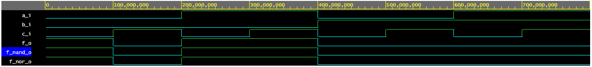
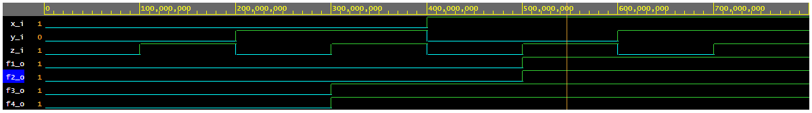

# LAB 01-Gates
Filip Sisolak (228030)


### 2. Verification of DeMorgan's laws

Completed table with logical values
| **c** | **b** |**a** | **f(c,b,a)** |
| :-: | :-: | :-: | :-: |
| 0 | 0 | 0 | 1 |
| 0 | 0 | 1 | 0 |
| 0 | 1 | 0 | 0 |
| 0 | 1 | 1 | 0 |
| 1 | 0 | 0 | 1 |
| 1 | 0 | 1 | 1 |
| 1 | 1 | 0 | 0 |
| 1 | 1 | 1 | 0 |

**Link to EDA playground (DeMorgan's laws) ->**
https://www.edaplayground.com/x/F8Mp

**Architecture of code**
```bash
architecture dataflow of gates is

 begin
    f_o  <= ((not b_i) and a_i) or ((not c_i) and (not b_i)) ;
    f_nor_o <= not(b_i or (not a_i)) or not(c_i or b_i);
    f_nand_o <= not(not(not b_i and  a_i) and not(not c_i and not b_i));
  
end architecture dataflow;
```
**Simulation of DeMorgan's laws**


### 3. Verification of Distributive laws

**Link to EDA playground (Distributive laws) ->** 
https://www.edaplayground.com/x/vTeD

**Architecture of code**
```bash
architecture dataflow of gates is
begin
    f1_o  <= (x_i and y_i) or (x_i and z_i); --First distribution Law
    f2_o  <= x_i and (y_i or z_i);           --First equation f1_o = f2_o
    f3_o  <= (x_i or y_i) and (x_i or z_i);  --Second distribution Law
    f4_o  <= x_i or (y_i and z_i);           --Second equation f3_o = f4_o
     
end architecture dataflow;
```
**Simulation of Distributive laws**



