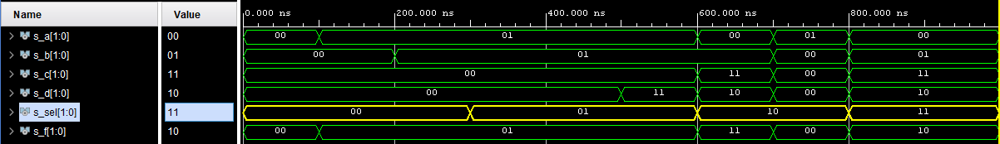

# 03-Vivado
### GitHub repository link
https://github.com/xsisol01/Digital-electronics-1.git

## 1. Preparation tasks
* table with connection of 16 slide switches and 16 LEDs on Nexys A7 board

| **Switch** | **Connection** | **LED** | **Connection** | 
| :-: | :-: | :-: | :-: |
| SW0 | J15 | LED0 | H17 |
| SW1 | L16 | LED1 | K15 |
| SW2 | M13 | LED2 | J13 |
| SW3 | R15 | LED3 | N14 |
| SW4 | R17 | LED4 | R18 |
| SW5 | T18 | LED5 | V17 |
| SW6 | U18 | LED6 | U17 |
| SW7 | R13 | LED7 | U16 |
| SW8 | T8 | LED8 | V16 |
| SW9 | U8 | LED9 | T15 |
| SW10 | R16 | LED10 | U14 |
| SW11 | T13 | LED11 | T16 |
| SW12 | H6 | LED12 | V15 |
| SW13 | U12 | LED13 | V14 |
| SW14 | U11 | LED14 | V12 |
| SW15 | V10 | LED15 | V11 |

## 2. Two-bit wide 4-to-1 multiplexer
* Listing  of VHDL architecture
```vhdl
architecture Behavioral of mux_2bit_4to1 is
  begin
   
     f_o <= a_i when(sel_i = "00") else
            b_i when(sel_i = "01") else
            c_i when(sel_i = "10") else
            d_i;

end architecture Behavioral;
```
*  Listing of VHDL stimulus process from testbench file
```vhdl
p_stimulus : process
    begin
        report "Stimulus process started" severity note;
        
        s_d <= "00"; s_c <= "00"; s_b <= "00"; s_a <= "00";
        s_sel <= "00"; wait for 100ns;
        
        s_a   <= "01"; wait for 100ns;
        s_b   <= "01"; wait for 100ns;
        
        s_sel <= "01"; wait for 100ns;
        s_c   <= "00"; wait for 100ns;
        s_d   <= "11"; wait for 100ns;
        
        s_d <= "10"; s_c <= "11"; s_b <= "01"; s_a <= "00";
        s_sel <= "10"; wait for 100ns;
        
        s_d <= "00"; s_c <= "00"; s_b <= "00"; s_a <= "01";
        s_sel <= "10"; wait for 100ns;
        
        s_d <= "10"; s_c <= "11"; s_b <= "01"; s_a <= "00";
        s_sel <= "11"; wait for 100ns;
                  
     
      report "Stimulus process started" severity note;
    wait;
  end process p_stimulus;
end architecture testbench;
```
* Screenshot with stimulated time waveforms



## 3. A Vivado tutorial
#### 1. Project creation
  1. QuickStart -> Create Project 
  2. **Project Name:** Set project name/directory 
  3. **Project Type:** Choose RTL project
  4. **Add Sources:** Create File -> File Type: VHDL, choose name without spaces -> OK!
  5. **Add Constrains:** You can do that later in project!
  6. **Default Part:** Boards -> choose your board (Nexys A7-50T)
  7. **Project Summary:** Finish
#### 2. Adding source file
  1. File -> Add Sources
  2. **Add Sources:** Choose "Add or create design sources"
  3. **Add or Create Design Sources:** Create File -> File Type: VHDL, choose name -> OK! -> Finish

#### 3. Adding testbench file
  1. File -> Add Sources
  2. **Add Sources:** Choose "Add or create simulation sources"
  3. **Add or Create Simulation Sources:** Create File -> File Type: VHDL, choose name with tb_ at the beginning  -> OK! -> Finish

#### 4. Running Simulation
  1. Flow Navigator -> SIMULATION -> Run Simulation -> Run Behavioral Simulation

  1. Flow -> Run Simulation -> Run Behavioral Simulation

#### 5. Adding XDC constraints file
  1.  File -> Add Sources
  2.  **Add Sources:** Choose "Add or create constraints"
  3.  **Add or Create Constraints:** Create File -> File Type: XDC, choose same name as board name -> OK! -> Finish


