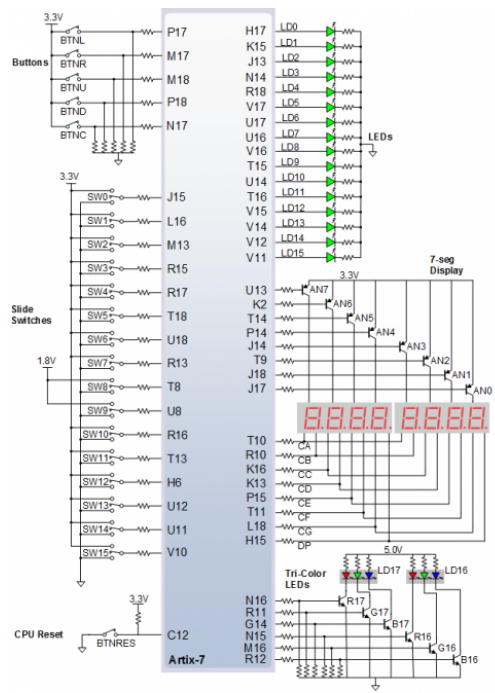

# 04-Segment

### GitHub repository link
https://github.com/xsisol01/Digital-electronics-1.git

## 1. Preparation tasks
* Figure with connection of 7-segment displays on Nexys A7 board


* Decoder truth table for common anode 7-segment displays on Nexys A7 board

| Hex | Inputs | A | B | C | D | E | F | G |
| :-: | :-: | :-: | :-: | :-: | :-: | :-: | :-: | :-: |
| 0 | 0000 | 0 | 0 | 0 | 0 | 0 | 0 | 1 |
| 1 | 0001 | 1 | 0 | 0 | 1 | 1 | 1 | 1 |
| 2 | 0010 | 0 | 0 | 1 | 0 | 0 | 1 | 0 |
| 3 | 0011 | 0 | 0 | 0 | 0 | 1 | 1 | 0 |
| 4 | 0100 | 1 | 0 | 0 | 1 | 1 | 0 | 0 |
| 5 | 0101 | 0 | 1 | 0 | 0 | 1 | 0 | 0 |
| 6 | 0110 | 0 | 1 | 0 | 0 | 0 | 0 | 0 |
| 7 | 0111 | 0 | 0 | 1 | 1 | 1 | 1 | 1 |
| 8 | 1000 | 0 | 0 | 0 | 0 | 0 | 0 | 0 |
| 9 | 1001 | 0 | 0 | 0 | 0 | 1 | 0 | 0 |
| A | 1010 | 0 | 0 | 0 | 1 | 0 | 0 | 0 |
| b | 1011 | 1 | 1 | 0 | 0 | 0 | 0 | 0 |
| C | 1100 | 0 | 1 | 1 | 0 | 0 | 0 | 1 |
| d | 1101 | 1 | 0 | 0 | 0 | 0 | 1 | 0 |
| E | 1110 | 0 | 1 | 1 | 0 | 0 | 0 | 0 |
| F | 1111 | 0 | 1 | 1 | 1 | 0 | 0 | 0 |

## 0. Seven-segment display decoder
* Listing of VHDL architecture from source file hex_7seg.vhd

```vhdl

```

* Listing of VHDL stimulus process from testbench file tb_hex_7seg.vhd

```vhdl

```

* Screenshot with simulated time waveforms


* Listing of VHDL code from source file top.vhd
```vhdl

```

## LED(7:4) indicators 
* Truth table for LEDs(7:4)

| **Hex** | **Inputs** | **LED4** | **LED5** | **LED6** | **LED7** |
| :-: | :-: | :-: | :-: | :-: | :-: |
| 0 | 0000 | 1 | 0 | 0 | 0 |
| 1 | 0001 | 0 | 0 | 1 | 1 |
| 2 | 0010 | 0 | 0 | 0 | 1 |
| 3 | 0011 | 0 | 0 | 1 | 0 |
| 4 | 0100 | 0 | 0 | 0 | 1 |
| 5 | 0101 | 0 | 0 | 1 | 0 |
| 6 | 0110 | 0 | 0 | 0 | 0 |
| 7 | 0111 | 0 | 0 | 1 | 0 |
| 8 | 1000 | 0 | 0 | 0 | 1 |
| 9 | 1001 | 0 | 0 | 1 | 0 |
| A | 1010 | 0 | 1 | 0 | 0 |
| b | 1011 | 0 | 1 | 1 | 0 |
| C | 1100 | 0 | 1 | 0 | 0 |
| d | 1101 | 0 | 1 | 1 | 0 |
| E | 1110 | 0 | 1 | 0 |  |
| F | 1111 | 0 | 1 | 1 |  |

* Listing of VHDL code for LEDs(7:4)

```vhdl

```
* Screenshot with stimulated time waveforms


