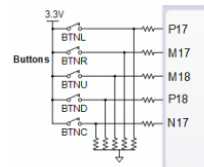

# 05-Counter

### GitHub repository link
https://github.com/xsisol01/Digital-electronics-1.git

## 1. Preparation tasks
* Figure with connection of push buttons on NexysA7 board



| Button |  FPGA Pin | LV not pressed  | LV pressed | 
| :-: | :-: | :-: | :-: |
| BTNL | P17 | 0 | 3.3 | 
| BTNR | M17 | 0 | 3.3 | 
| BTNU | M18 | 0 | 3.3 | 
| BTND | P18 | 0 | 3.3 | 
| BTNC | N17 | 0 | 3.3 | 

* Table with calculated values   
   | **Time interval** | **Number of clk periods** | **Number of clk periods in hex** | **Number of clk periods in binary** |
   | :-: | :-: | :-: | :-: |
   | 2&nbsp;ms | 200 000 | `x"3_0d40"` | `b"0011_0000_1101_0100_0000"` |
   | 4&nbsp;ms | 400 000 | `x"6_1a80"` | `b"0110_0001_1010_1000_0000"` |
   | 10&nbsp;ms | 1 000 000 | `x"f_4240"` | `b"1111_0100_0010_0100_0000"` |
   | 250&nbsp;ms | 25 000 000 | `x"17d_7840"` | `b"0001_0111_1101_0111_1000_0100_0000"` |
   | 500&nbsp;ms | 50 000 000 | `x"2fA_f080"` | `b"0010_1111_1010_1111_0000_1000_0000"` |
   | 1&nbsp;sec | 100 000 000 | `x"5f5_e100"` | `b"0101_1111_0101_1110_0001_0000_0000"` |

## 2. Bidirectional counter
* Listing of VHDL code of the process p_cnt_up_down 

```vhdl
 p_cnt_up_down : process(clk)
    begin
        if rising_edge(clk) then
        
            if (reset = '1') then               
                s_cnt_local <= (others => '0'); 

            elsif (en_i = '1') then     
                if(cnt_up_i = '1')then
                    s_cnt_local <= s_cnt_local + 1;
                else    
                    s_cnt_local <= s_cnt_local - 1;
               end if;

            end if;
        end if;
    end process p_cnt_up_down;
```    
* Listing of VHDL reset and stimulus processes from testbench file tb_cnt_up_down.vhd

```vhdl
    p_reset_gen : process
    begin
        s_reset <= '0';
        wait for 12 ns;
        
        -- Reset activated
        s_reset <= '1';
        wait for 73 ns;

        s_reset <= '0';
        wait;
    end process p_reset_gen;

    --------------------------------------------------------------------
    -- Data generation process
    --------------------------------------------------------------------
    p_stimulus : process
    begin
        report "Stimulus process started" severity note;

        -- Enable counting
        s_en     <= '1';
        
        -- Change counter direction
        s_cnt_up <= '1';
        wait for 380 ns;
        s_cnt_up <= '0';
        wait for 220 ns;

        -- Disable counting
        s_en     <= '0';

        report "Stimulus process finished" severity note;
        wait;
    end process p_stimulus;
```

* Screenshot with simulated time waveforms  


## 3. Top level

* Listing of VHDL code from source file top.vhd with all instantiations for the 4-bit   bidirectional counter
* Image of the top layer including both counters, ie a 4-bit bidirectional counter from Part 4 and a 16-bit counter with a different time base from Part Experiments on your own
