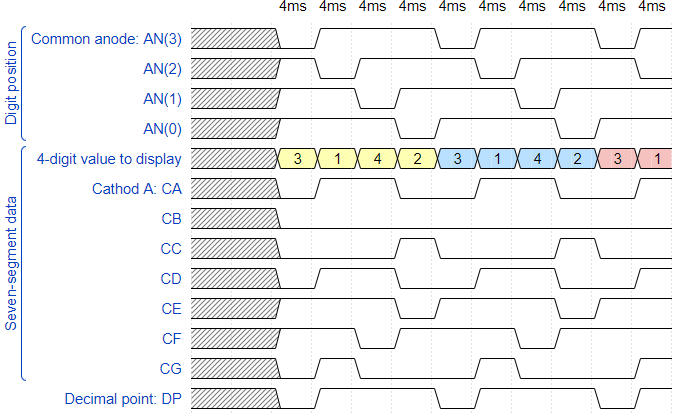

# 06-Display driver

### GitHub repository link
https://github.com/xsisol01/Digital-electronics-1.git

## 1. Preparation tasks
* Timing diagram figure for displaying value 3.142




## 2. Display driver
* Listing of VHDL code of the process p_mux 

```vhdl
 
```    
* Listing of VHDL testebech file tb_driver_7seg_4digits

```vhdl
   
```

* Screenshot with simulated time waveforms  


* Listing of VHDL architecture of the top layer

```vhdl

```

## 3. Eight-digit driver 

* Image of the driver schematic


