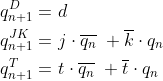
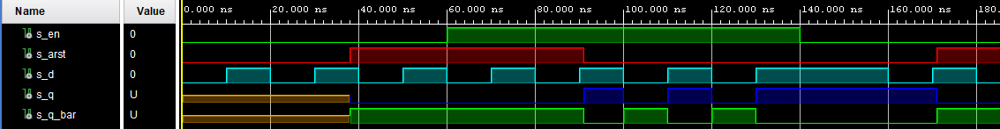
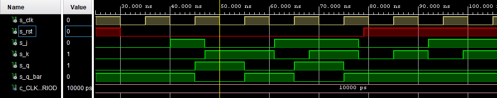
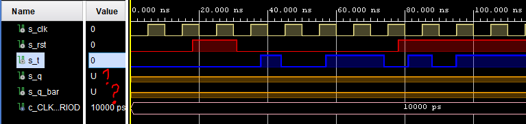
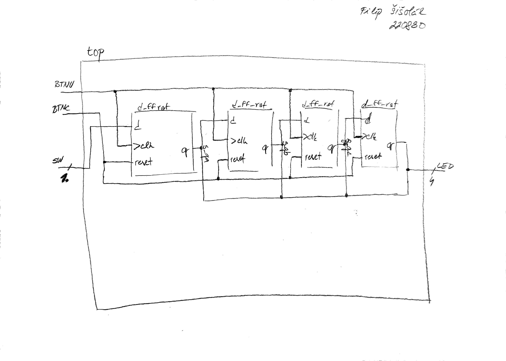

# 07-Latches and Flip-Flops

### GitHub repository link
https://github.com/xsisol01/Digital-electronics-1.git

## 1. Preparation tasks
* Characteristic equations


<!--
\begin{align*}
    q_{n+1}^D = &~ d &\\
    q_{n+1}^{JK} = &~ j\cdot \overline{q_n}\ +\overline{k}\cdot q_n &\\
    q_{n+1}^T =&~ t\cdot \overline{q_n}\ +\overline{t}\cdot q_n &\\
\end{align*}-->

* Completed table for D FF

   | **clk** | **d** | **q(n)** | **q(n+1)** | **Comments** |
   | :-: | :-: | :-: | :-: | :-- |
   |  | 0 | 0 | 0 | Input signal is sampled at the rising edge of clk and stored to FF |
   |  | 0 | 1 | 0 | Input signal is sampled at the rising edge of clk and stored to FF |
   |  | 1 | 0 | 1 | Input signal is sampled at the rising edge of clk and stored to FF |
   |  | 1 | 1 | 1 | Input signal is sampled at the rising edge of clk and stored to FF |
   
   
* Completed table for JK FF

   | **clk** | **j** | **k** | **q(n)** | **q(n+1)** | **Comments** |
   | :-: | :-: | :-: | :-: | :-: | :-- |
   |  | 0 | 0 | 0 | 0 | No change |
   |  | 0 | 0 | 1 | 1 | No change |
   |  | 0 | 1 | 0 | 0 | Reset |
   |  | 0 | 1 | 1 | 0 | Reset |
   |  | 1 | 0 | 0 | 1 | Set |
   |  | 1 | 0 | 1 | 1 | Set |
   |  | 1 | 1 | 0 | 1 | Toggle |
   |  | 1 | 1 | 1 | 0 | Toggle |

* Completed table for T FF

   | **clk** | **t** | **q(n)** | **q(n+1)** | **Comments** |
   | :-: | :-: | :-: | :-: | :-- |
   |  | 0 | 0 | 0 | No change |
   |  | 0 | 1 | 1 | No change |
   |  | 1 | 0 | 1 | Invert |
   |  | 1 | 1 | 0 | Invert |


## 2. D-Latch
* VHDL code of the process p_d_latch

```vhdl
p_d_latch : process (d, arst, en)
    begin
        if (arst = '1') then
            q <= '0';
            q_bar <= '1';
        elsif(en = '1') then 
            q <= d;
            q_bar <= not d;    
        end if;
 end process p_d_latch;
```    
* VHDL reset and stimulus processes from tb_d_latch

```vhdl
p_reset_gen : process
 begin
	 s_arst <= '0';
	 wait for 38 ns;
	 
	 -- Reset activated
	 s_arst <= '1';
	 wait for 53 ns;

	 --Reset deactivated
	 s_arst <= '0';
	
	 wait for 80 ns;
	 s_arst <= '1';

	 wait;
 end process p_reset_gen;

--------------------------------------------------------------------
-- Data generation process
--------------------------------------------------------------------
p_stimulus : process
begin
	report "Stimulus process started" severity note;
	
	s_d  <= '0';
	s_en <= '0';
	wait for 10 ns;
	
	--remember/hold values (no value to hold)
	s_d  <= '1';
	wait for 10 ns;
	s_d  <= '0';
	wait for 10 ns;
	s_d  <= '1';
	--reset set to 1 -> all values '0' except q_bar
	wait for 10 ns;
	s_d  <= '0';
	wait for 10 ns;
	s_d  <= '1';
	wait for 10 ns;

	--Reseting output q
	s_d  <= '0';
	s_en <= '1';
	assert ((s_arst = '0') and (s_en = '1'))
	report "s_en setted to one -> Reseting output q" severity note;	
	wait for 10 ns;
	
	--Seting output q - en is setted to 1
	s_d  <= '1';
	assert ((s_arst = '0') and (s_en = '1'))
	report "s_en setted to one -> Seting output q" severity note;	
	wait for 10 ns;
	
	
	s_d  <= '0';
	wait for 10 ns;   
	s_d  <= '1';
	wait for 10 ns;
	s_d  <= '0';
	wait for 10 ns;
	s_d  <= '1';
	--reset set to 0 - again operating 
	wait for 10 ns;
	s_d  <= '0';
	wait for 10 ns;
	s_d  <= '1';
	wait for 10 ns;


	-- Remember/hold values 
	s_en <= '0';
	assert ((s_arst = '0') and (s_en = '0'))
	report "s_en setted to zero -> remember/hold value" severity note;
	wait for 10 ns;
	
	s_d  <= '1';
	wait for 10 ns;
	s_d  <= '0';
	wait for 10 ns;
	s_d  <= '1';
	wait for 10 ns;
	s_d  <= '0';
	wait for 10 ns;
	s_d  <= '1';
	--reset set to 1 - all values should be '0'
	wait for 10 ns;
	s_d  <= '0';
	wait for 10 ns;
	s_d  <= '1';
	wait for 10 ns;
	s_d  <= '0';
	
	report "Stimulus process finished" severity note;
	wait;
end process p_stimulus;
      
```

* Screenshot with simulated time waveforms  



## 3. Flip-flops

* VHDL code of p_d_ff_arst

```vhdl
    p_d_ff_arst : process (clk, arst)                    
   begin                                             
       if (arst = '1') then                          
           q <= '0';                                 
           q_bar <= '1';                             
       elsif rising_edge(clk) then                        
           q <= d;                                   
           q_bar <= not d;                           
       end if;                                       
end process p_d_ff_arst
```
* VHDL code of p_d_ff_rst

```vhdl
p_d_ff_arst : process (clk)                    
   begin                                             
       if rising_edge (clk) then 
        if (rst = '1') then 
            q     <= '0';
            q_bar <= '1';
        else
            q     <= d;    
            q_bar <= not d;
        end if;
       end if;
```
* VHDL code of p_jk_ff_rst

```vhdl
p_jk_ff_rst : process (clk)
begin
    if rising_edge(clk) then
        if (rst = '1') then
            s_q <= '0';
        else
            if (j = '0' and k = '0') then
                s_q <= s_q;
            elsif (j = '0' and k = '1') then
                s_q <= '0';
            elsif (j = '1' and k = '0') then
                s_q <= '1';
            elsif (j = '1' and k = '1') then
                s_q <= not s_q;
            
            end if;
        end if;
    end if;

end process p_jk_ff_rst;
```
* VHDL code of p_t_ff_rst

```vhdl
p_t_ff_rst : process (clk)
begin
    if rising_edge(clk) then
        if ( rst = '1' ) then
            q <= '0';
            q_bar <= '1';
        else 
            if t = '0' then 
              s_q <= s_q;
            else 
              s_q <= not s_q;  
            end if;
        end if;
     end if;                 
end process p_t_ff_rst;
```

* VHDL clock, reset, stimulus processes from testbech files d arst

```vhdl
     --------------------------------------------------------------------
    -- Clock generation process
    --------------------------------------------------------------------
    p_clk_gen : process
    begin
        while now < 40 ms loop        
            s_clk <= '0';
            wait for c_CLK_100MHZ_PERIOD / 2;
            s_clk <= '1';
            wait for c_CLK_100MHZ_PERIOD / 2;
        end loop;
        wait;
    end process p_clk_gen;
    
    --------------------------------------------------------------------
    -- Reset generation process
    --------------------------------------------------------------------

     p_reset_gen : process
        begin
            s_arst <= '0';
            wait for 28 ns;
            
            -- Reset activated
            s_arst <= '1';
            wait for 13 ns;
    
            --Reset deactivated
            s_arst <= '0';
            
            wait for 17 ns;
            
            s_arst <= '1';
            wait for 33 ns;
            
            wait for 660 ns;
            s_arst <= '1';
    
            wait;
     end process p_reset_gen;

    --------------------------------------------------------------------
    -- Data generation process
    --------------------------------------------------------------------
    p_stimulus : process
    begin
        report "Stimulus process started" severity note;
        
        s_d  <= '0';
        wait for 14 ns;
        
        s_d  <= '1';
        wait for 2 ns;
        
        
        wait for 8 ns;
        s_d  <= '0';
        wait for 6 ns;
        
        wait for 4 ns;
        s_d  <= '1';
        wait for 10 ns;
        s_d  <= '0';
        wait for 10 ns;
        s_d  <= '1';
        wait for 5 ns;
        
        assert ((s_arst = '1') and (s_q = '0') and (s_q_bar = '1'))
        report "If you see this its Not asynch reset" severity error;
        
        wait for 5 ns;
        s_d  <= '0';
        
        wait for 14 ns;
        s_d  <= '1';
        wait for 10 ns;
        s_d  <= '0';
        wait for 10 ns;
        s_d  <= '1';
        wait for 10 ns;
        s_d  <= '0';
        wait for 10 ns;
        s_d  <= '1';
        wait for 10 ns;
        s_d  <= '0';
        
        
       
        report "Stimulus process finished" severity note;
        wait;
    end process p_stimulus;
```

* VHDL clock, reset, stimulus processes from testbech files d rst

```vhdl
    
      --------------------------------------------------------------------
    -- Clock generation process
    --------------------------------------------------------------------
    p_clk_gen : process
    begin
        while now < 40 ms loop        
            s_clk <= '0';
            wait for c_CLK_100MHZ_PERIOD / 2;
            s_clk <= '1';
            wait for c_CLK_100MHZ_PERIOD / 2;
        end loop;
        wait;
    end process p_clk_gen;
    
    --------------------------------------------------------------------
    -- Reset generation process
    --------------------------------------------------------------------

     p_reset_gen : process
        begin
            s_rst <= '0';
            wait for 28 ns;
            
            -- Reset activated
            s_rst <= '1';
            wait for 13 ns;
    
            --Reset deactivated
            s_rst <= '0';
            
            wait for 17 ns;
            
            s_rst <= '1';
            wait for 33 ns;
            
            wait for 660 ns;
            s_rst <= '1';
    
            wait;
     end process p_reset_gen;

    --------------------------------------------------------------------
    -- Data generation process
    --------------------------------------------------------------------
    p_stimulus : process
    begin
        report "Stimulus process started" severity note;
        
        s_d  <= '0';
        wait for 14 ns;
        
        s_d  <= '1';
        wait for 2 ns;
        
        
        wait for 8 ns;
        s_d  <= '0';
        wait for 6 ns;
        
        wait for 4 ns;
        s_d  <= '1';
        wait for 10 ns;
        s_d  <= '0';
        wait for 10 ns;
        s_d  <= '1';
        wait for 10 ns;
   
        s_d  <= '0';
        
        wait for 14 ns;
        s_d  <= '1';
        wait for 10 ns;
        s_d  <= '0';
        wait for 10 ns;
        s_d  <= '1';
        wait for 10 ns;
        s_d  <= '0';
        wait for 10 ns;
        s_d  <= '1';
        wait for 10 ns;
        s_d  <= '0';
        
        
       
        report "Stimulus process finished" severity note;
        wait;
    end process p_stimulus;
```

* VHDL clock, reset, stimulus processes from testbech files jk rst

```vhdl
--------------------------------------------------------------------
-- Clock generation process
--------------------------------------------------------------------
    p_clk_gen : process
    begin
        while now < 40 ms loop        
            s_clk <= '0';
            wait for c_CLK_100MHZ_PERIOD / 2;
            s_clk <= '1';
            wait for c_CLK_100MHZ_PERIOD / 2;
        end loop;
        wait;
    end process p_clk_gen;
    
--------------------------------------------------------------------
-- Reset generation process
--------------------------------------------------------------------

     p_reset_gen : process
        begin
            s_rst <= '0';
            wait for 18 ns;
            
            -- Reset activated
            s_rst <= '1';
            wait for 12 ns;
    
            --Reset deactivated
            s_rst <= '0';
            
            wait for 49 ns;
            
            s_rst <= '1';
            wait for 33 ns;
            
            wait for 660 ns;
            s_rst <= '1';
    
            wait;
     end process p_reset_gen;

 --------------------------------------------------------------------
 -- Data generation process
 --------------------------------------------------------------------
    p_stimulus : process
    begin
        report "Stimulus process started" severity note;
           
        s_j  <= '0';
        s_k  <= '0';
        
        
        wait for 38 ns;
        
        assert ((s_rst = '0') and (s_j = '0') and (s_k = '0') and (s_q = '0') and (s_q_bar = '1'))
        report "no change fail for s_j = '0' and s_k = '0'" severity error;
        
        wait for 2 ns;
        s_j  <= '1';
        s_k  <= '0';
        wait for 6 ns;
        
        assert ((s_rst = '0') and (s_j = '1') and (s_k = '0') and (s_q = '1') and (s_q_bar = '0'))
        report "set failed for s_j = '1' and s_k = '0'" severity error;
        
        wait for 1 ns;
        s_j  <= '0';
        s_k  <= '1';
        wait for 13 ns;
        
        assert ((s_rst = '0') and (s_j = '0') and (s_k = '1') and (s_q = '0') and (s_q_bar = '1'))
        report "reset fail for s_j = '0' and s_k = '1'" severity error;
        
        wait for 1 ns;
        s_j  <= '1';
        s_k  <= '0';
        wait for 7 ns;
        s_j  <= '1';
        s_k  <= '1';
        
        wait for 8 ns;
        
        assert ((s_rst = '0') and (s_j = '1') and (s_k = '1') and (s_q = '0') and (s_q_bar = '1'))
        report "toggle fail for s_j = '1' and s_k = '1'" severity error;
        
        wait for 2 ns;
        s_j  <= '0';
        s_k  <= '0';
        wait for 7 ns;
        s_j  <= '0';
        s_k  <= '1';
        wait for 7 ns;
        s_j  <= '1';
        s_k  <= '0';
        wait for 7 ns;
        s_j  <= '1';
        s_k  <= '1';
        
        report "Stimulus process finished" severity note;
        wait;
    end process p_stimulus;
```

* VHDL clock, reset, stimulus processes from testbech files t rst

```vhdl
    --------------------------------------------------------------------
    -- Clock generation process
    --------------------------------------------------------------------
    p_clk_gen : process
    begin
        while now < 40 ms loop        
            s_clk <= '0';
            wait for c_CLK_100MHZ_PERIOD / 2;
            s_clk <= '1';
            wait for c_CLK_100MHZ_PERIOD / 2;
        end loop;
        wait;
    end process p_clk_gen;
    
    --------------------------------------------------------------------
    -- Reset generation process
    --------------------------------------------------------------------

     p_reset_gen : process
        begin
            s_rst <= '0';
            wait for 18 ns;
            
            -- Reset activated
            s_rst <= '1';
            wait for 13 ns;
    
            --Reset deactivated
            s_rst <= '0';
            
            wait for 47 ns;
            
            s_rst <= '1';
            wait for 33 ns;
            
            wait for 660 ns;
            s_rst <= '1';
    
            wait;
     end process p_reset_gen;

    --------------------------------------------------------------------
    -- Data generation process
    --------------------------------------------------------------------
    p_stimulus : process
    begin
        report "Stimulus process started" severity note;
       --No change 
        s_t  <= '0';
        wait for 38 ns;
        --Invert
        s_t  <= '1';
        wait for 6 ns;
        --No Change
        s_t  <= '0';
        wait for 13 ns;
        --Invert
        s_t  <= '1';        
        wait for 17 ns;
        --No change
        s_t  <= '0';
        wait for 7 ns;
        --Invert
        s_t  <= '1';
        wait for 7 ns;
        --No chagne
        s_t  <= '0';
        wait for 7 ns;
        --Invert
        s_t  <= '1';
           
        report "Stimulus process finished" severity note;
        wait;
    end process p_stimulus;
```
* Screenshot with simulated time waveforms

d_ff_arst


d_ff_rst


jk_ff_rst



t_ff_rst




## 4. Shift register

* Image of the shift register schenatic


