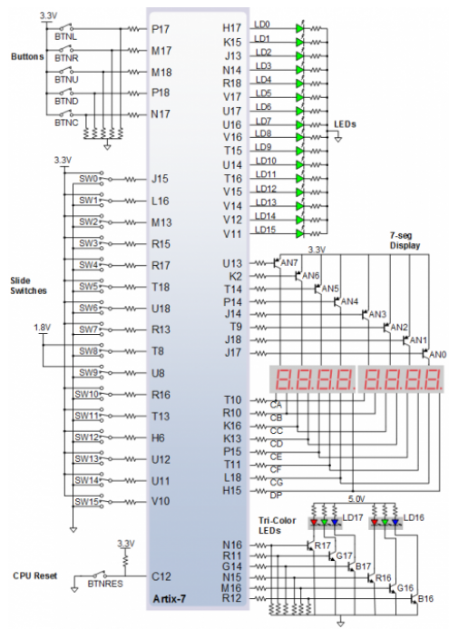
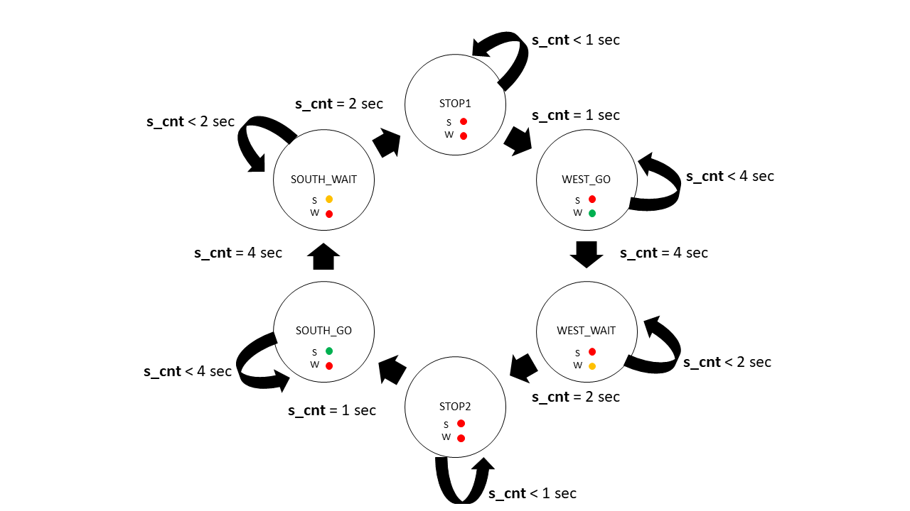
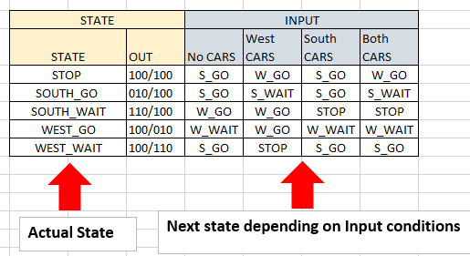
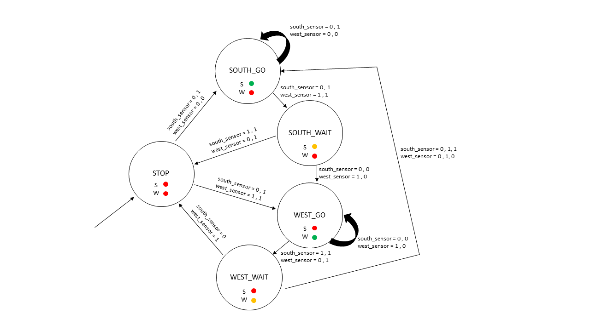

# 08-Traffic light controller

### GitHub repository link
https://github.com/xsisol01/Digital-electronics-1.git

## 1. Preparation tasks
* State table 

| **Input P** | `0` | `0` | `1` | `1` | `0` | `1` | `0` | `1` | `1` | `1` | `1` | `0` | `0` | `1` | `1` | `1` |
| :-- | :-: | :-: | :-: | :-: | :-: | :-: | :-: | :-: | :-: | :-: | :-: | :-: | :-: | :-: | :-: | :-: |
| **Clock** |  |  |  |  |  |  |  |  |  |  |  |  |  |  |  |  |
| **State** | A | A | B | C | C | D | A | B | C | D | D | A | A | B | C | D |
| **Output R** | `0` | `0` | `0` | `0` | `0` | `1` | `0` | `0` | `0` | `1` | `1` | `0` | `0` | `0` | `0` | `1` |

* Figure with connection of RGB LEDs on NexysA7 Board



* Table with color settings

| **RGB LED** | **Artix-7 pin names** | **Red** | **Yellow** | **Green** |
| :-: | :-: | :-: | :-: | :-: |
| LD16 | N15, M16, R12 | `1,0,0` | `1,1,0` | `0,1,0` |
| LD17 | N16, R11, G14 | `1,0,0` | `1,1,0` | `0,1,0` |


## 2. Traffic light controller
* State diagram



* Listing of VHDL code of sequential process p_traffic_fsm

```vhdl
    p_traffic_fsm : process(clk)
    begin
        if rising_edge(clk) then
            if (reset = '1') then       -- Synchronous reset
                s_state <= STOP1 ;      -- Set initial state
                s_cnt   <= c_ZERO;      -- Clear all bits

            elsif (s_en = '1') then
                -- Every 250 ms, CASE checks the value of the s_state 
                -- variable and changes to the next state according 
                -- to the delay value.
                case s_state is

                    -- If the current state is STOP1, then wait 1 sec
                    -- and move to the next GO_WAIT state.
                    when STOP1 =>
                        -- Count up to c_DELAY_1SEC
                        if (s_cnt < c_DELAY_1SEC) then
                            s_cnt <= s_cnt + 1;
                        else
                            -- Move to the next state
                            s_state <= WEST_GO;
                            -- Reset local counter value
                            s_cnt   <= c_ZERO;
                        end if;

                    when WEST_GO =>
                           --countup to c_Delay_4sec
                           if( s_cnt < c_DELAY_4SEC) then
                              s_cnt <= s_cnt + 1;
                           else
                              s_state <= WEST_WAIT;
                              s_cnt <= c_ZERO;  
                           end if;
                    
                    when WEST_WAIT =>
                        if (s_cnt <= c_DELAY_2SEC) then 
                            s_cnt <= s_cnt + 1;
                        else
                            s_state <= STOP2;
                            s_cnt <= c_ZERO;
                        end if;     
                    when STOP2 =>
                        if (s_cnt <= c_DELAY_1SEC) then 
                            s_cnt <= s_cnt + 1;
                        else
                            s_state <= SOUTH_GO;
                            s_cnt <= c_ZERO;
                        end if;
                        
                    when SOUTH_GO =>
                        if (s_cnt <= c_DELAY_4SEC) then 
                            s_cnt <= s_cnt + 1;
                        else
                            s_state <= SOUTH_WAIT;
                            s_cnt <= c_ZERO;
                        end if;
                        
                    when SOUTH_WAIT =>
                        if (s_cnt <= c_DELAY_2SEC) then 
                            s_cnt <= s_cnt + 1;
                        else
                            s_state <= STOP1;
                            s_cnt <= c_ZERO;
                        end if;                           
                
                    -- It is a good programming practice to use the 
                    -- OTHERS clause, even if all CASE choices have 
                    -- been made. 
                    when others =>
                        s_state <= STOP1;

                end case;
            end if; -- Synchronous reset
        end if; -- Rising edge
    end process p_traffic_fsm;    
```

* Listing of VHDL code of combinatorial process p_output_fsm

```vhdl
p_output_fsm : process(s_state)
    begin
        case s_state is
            when STOP1 =>
                south_o <= "100";   -- Red (RGB = 100)
                west_o  <= "100";   -- Red (RGB = 100)
            when WEST_GO =>
            
                south_o <= "100";   -- Red (RGB = 100)
                west_o  <= "010";   -- Green (RGB = 010)
            when WEST_WAIT =>
            
                south_o <= "100";   -- Red (RGB = 100)
                west_o  <= "110";   -- Orange (RGB = 110)
            when STOP2 =>
            
                south_o <= "100";   -- Red (RGB = 100)
                west_o  <= "100";   -- Red (RGB = 100)
                
            when SOUTH_GO =>
                south_o <= "010";   -- Green (RGB = 010)
                west_o  <= "100";   -- Red (RGB = 100)
                
            when SOUTH_WAIT =>
                south_o <= "110";   -- Orange (RGB = 110)
                west_o  <= "100";   -- Red (RGB = 100)
            
            when others =>
                south_o <= "100";   -- Red
                west_o  <= "100";   -- Red
        end case;
    end process p_output_fsm;    
```

* Screenshot with simulated time waveforms  


## 3. Smart controller
* State table



* State diagram



* Listing of VHDL code of sequential process p_smart_traffic_fsm

```vhdl
    p_smart_traffic_fsm : process(clk)
    begin
        if rising_edge(clk) then
            if (reset = '1') then       -- Synchronous reset
                s_state <= STOP ;      -- Set initial state
                s_cnt   <= c_ZERO;      -- Clear all bits

            elsif (s_en = '1') then
                -- Every 250 ms, CASE checks the value of the s_state 
                -- variable and changes to the next state according 
                -- to the delay value.
                
                --NO CARS coming to fork
                if ( south_sensor = '0' and west_sensor = '0') then
                    case s_state is
                         when STOP =>
                              s_state <= SOUTH_GO;
                         when SOUTH_GO =>
                              s_state <= SOUTH_GO;
                         when SOUTH_WAIT =>
                           
                           if( s_cnt < c_DELAY_05SEC) then
                              s_cnt <= s_cnt + 1/2;
                           else
                              s_state <= WEST_GO;
                              s_cnt <= c_ZERO;  
                           end if;
                         when WEST_GO =>
                              s_state <= WEST_GO; 
                         when WEST_WAIT =>
                          
                           if( s_cnt < c_DELAY_05SEC) then
                              s_cnt <= s_cnt + 1/2;
                           else
                              s_state <= SOUTH_GO;
                              s_cnt <= c_ZERO;  
                           end if;     
                        end case;
                -- CAR coming from SOUTH        
                elsif ( south_sensor = '1' and west_sensor = '0') then
                      case s_state is
                        when STOP =>
                            s_state <= SOUTH_GO;
                      
                        when SOUTH_GO =>          
                              s_state <= SOUTH_GO;
                              
                         when SOUTH_WAIT =>
                           
                           if( s_cnt < c_DELAY_05SEC) then
                              s_cnt <= s_cnt + 1/2;
                           else
                              s_state <= STOP;
                              s_cnt <= c_ZERO;  
                           end if;
                         when WEST_GO =>
                           
                           if( s_cnt < c_DELAY_3SEC) then
                              s_cnt <= s_cnt + 1;
                           else
                              s_state <= WEST_WAIT;
                              s_cnt <= c_ZERO;  
                           end if;
                         when WEST_WAIT =>
                           
                           if( s_cnt < c_DELAY_05SEC) then
                              s_cnt <= s_cnt + 1/2;
                           else
                              s_state <= SOUTH_GO;
                              s_cnt <= c_ZERO;  
                           end if;     
                        end case;
                -- CARS coming from WEST 
                elsif ( south_sensor = '0' and west_sensor = '1') then
                    case s_state is
                        when STOP =>
                            s_state <= WEST_GO;
                      
                        when WEST_GO =>          
                              s_state <= WEST_GO;
                              
                         when SOUTH_WAIT =>
                           
                           if( s_cnt < c_DELAY_05SEC) then
                              s_cnt <= s_cnt + 1/2;
                           else
                              s_state <= WEST_GO;
                              s_cnt <= c_ZERO;  
                           end if;
                         when SOUTH_GO =>
                           
                           if( s_cnt < c_DELAY_3SEC) then
                              s_cnt <= s_cnt + 1;
                           else
                              s_state <= SOUTH_WAIT;
                              s_cnt <= c_ZERO;  
                           end if;
                         when WEST_WAIT =>
                           
                           if( s_cnt < c_DELAY_05SEC) then
                              s_cnt <= s_cnt + 1/2;
                           else
                              s_state <= STOP;
                              s_cnt <= c_ZERO;  
                           end if;     
                        end case;
                elsif ( south_sensor = '1' and west_sensor = '1') then
                    case s_state is 
                        when STOP => 
                           
                           if( s_cnt < c_DELAY_2SEC) then
                              s_cnt <= s_cnt + 1;
                           else
                              s_state <= WEST_GO;
                              s_cnt <= c_ZERO;  
                           end if;   
                        when WEST_GO => 
                          
                           if( s_cnt < c_DELAY_3SEC) then
                              s_cnt <= s_cnt + 1;
                           else
                              s_state <= WEST_WAIT;
                              s_cnt <= c_ZERO;  
                           end if;
                        when WEST_WAIT => 
                           
                           if( s_cnt < c_DELAY_05SEC) then
                              s_cnt <= s_cnt + 1/2;
                           else
                              s_state <= SOUTH_GO;
                              s_cnt <= c_ZERO;  
                           end if;   
                        when SOUTH_GO => 
                           
                           if( s_cnt < c_DELAY_3SEC) then
                              s_cnt <= s_cnt + 1;
                           else
                              s_state <= SOUTH_WAIT;
                              s_cnt <= c_ZERO;  
                           end if; 
                        when SOUTH_WAIT => 
                           
                           if( s_cnt < c_DELAY_05SEC) then
                              s_cnt <= s_cnt + 1/2;
                           else
                              s_state <= STOP;
                              s_cnt <= c_ZERO;  
                           end if;  
                        end case;      
                end if;
            end if; -- Synchronous reset
        end if; -- Rising edge
    end process p_smart_traffic_fsm;
```
