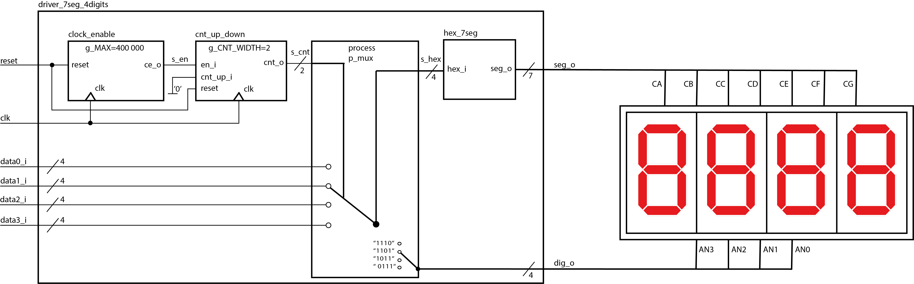
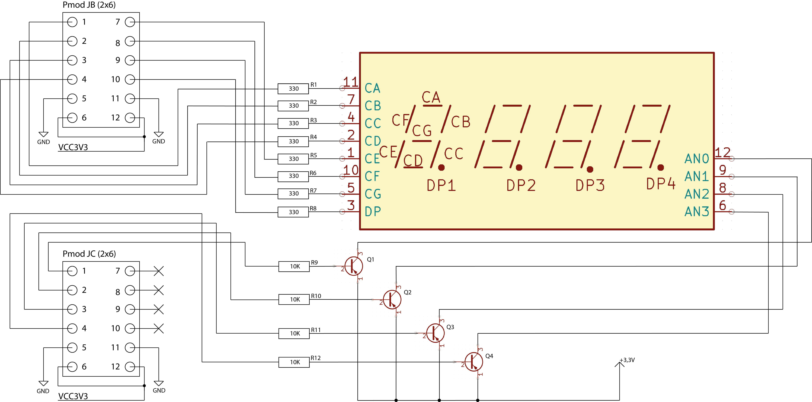

# Door lock system with PIN (4-digit) terminal, 4x3 push buttons, 4-digit 7-segment display, relay for door lock control.

### Team members
* Bohuslav Šotola
* Tomáš Škurla
* Barbora Šimková
* Filip Šišolák

* Github repository link : https://github.com/xsisol01/Digital-electronics-1/tree/main/Labs

### Project objectives
??

## Hardware description

## VHDL modules description and simulations

### KeyPad controll module

este dopisat nejake info k modulu

##### VHDL code of KeyPad controll - keypad_to_num.vhdl

```vhdl
library ieee;
use ieee.std_logic_1164.all;
use ieee.numeric_std.all;

------------------------------------------------------------------------
-- Entity declaration for traffic light controller
------------------------------------------------------------------------
entity keypad_to_num is
    port(
        clk         : in  std_logic;
        reset       : in  std_logic;
        row_i       : in  std_logic_vector(4 - 1 downto 0);     -- input from keypad
        
        col_o       : out std_logic_vector(3 - 1 downto 0);     -- output to keypad
        num_o       : out std_logic_vector(4 - 1 downto 0)      --Output signal with 4bit number 0-9, enter, delete
        
    );
end entity keypad_to_num;

------------------------------------------------------------------------
-- Architecture declaration for traffic light controller
------------------------------------------------------------------------
architecture Behavioral of keypad_to_num is

    -- Define the states
    type t_state is (SET_COLH,      --after reset
                     SET_COL1,
                     SET_COL2,
                     SET_COL3
                     );
        
    -- Define the signal that uses different states
    signal s_state  : t_state;
    -- Internal clock enable
    signal s_en     : std_logic; --not needed in this case
    -- Local delay counter
    signal   s_cnt  : unsigned(5 - 1 downto 0);
   
   
    constant c_DELAY_100ms : unsigned(5 - 1 downto 0) := b"0_0010"; --one pulse every 100ms
    constant c_ZERO        : unsigned(5 - 1 downto 0) := b"0_0000";


begin


    clk_en0 : entity work.clock_enable
        generic map(
            g_MAX => 5000000       -- g_MAX = 50 ms / (1/100 MHz) 
        )
        port map(
            clk   => clk,
            reset => reset,
            ce_o  => s_en
        );

    --Process sensitive to clock change, defining state machine rules
    p_in_to_num_out : process(clk)
    begin
        if rising_edge(clk) then
            if (reset = '1') then          -- Synchronous reset
                s_state <= SET_COLH ;      -- Set initial state
                --s_cnt <= c_ZERO;

            elsif (s_en = '1') then
            
                case s_state is
                    when SET_COLH =>
                        if (s_cnt < c_DELAY_100ms) then
                            s_cnt <= s_cnt + 1;   
                        else
                            s_state <= SET_COL1;
                            s_cnt <= c_ZERO;
                        end if;
                        
                    when SET_COL1 =>
                        if (s_cnt < c_DELAY_100ms) then
                            s_cnt <= s_cnt + 1;
                        else
                            s_state <= SET_COL2;
                            s_cnt <= c_ZERO;
                       end if;
                           
                    when SET_COL2 =>
                        if (s_cnt < c_DELAY_100ms) then
                            s_cnt <= s_cnt + 1; 
                        else
                            s_state <= SET_COL3;
                            s_cnt <= c_ZERO;
                        end if;
                        
                    when SET_COL3 =>
                        if (s_cnt < c_DELAY_100ms) then
                            s_cnt <= s_cnt + 1; 
                        else
                            s_state <= SET_COL1;
                            s_cnt <= c_ZERO;
                        end if; 
                           
                    when others =>
                        s_state <= SET_COLH;                   
               end case;            
            end if; -- Synchronous reset
        end if; -- Rising edge
    end process p_in_to_num_out;

    --Process senstitive on current state and setting output to columns
    p_output_statechanger : process(s_state)
    begin
        case s_state is
            when SET_COLH =>
                col_o <= "111";   
            when SET_COL1 =>
                col_o <= "011";    
            when SET_COL2 =>
                col_o <= "101";     
            when SET_COL3 =>
                col_o <= "110";
            when others =>
                col_o <= "111";
        end case;
    end process p_output_statechanger;
    
    
    --Process sensitive to row_i changes and setting output based on current state
    p_output_row_check_out : process(row_i)
    begin
        case s_state is
            when SET_COLH =>
                num_o <= "1101";                -- default
                
            when SET_COL1 =>
                if(row_i = "0111") then
                    num_o <= "0001";            --set output 1 - pressed
                               
                elsif(row_i = "1011") then  
                    num_o <= "0100";            --set output 4 - pressed
                                
                elsif(row_i = "1101") then  
                    num_o <= "0111";            --set output 7 - pressed  
                                
                elsif(row_i = "1110") then  
                    num_o <= "1110";            --set output *(delete) - pressed
                else 
                    num_o <= "1101";            --defult            
                end if;
                
            when SET_COL2 =>
                if(row_i = "0111") then
                    num_o <= "0010";            --set output 2 - pressed
                            
                elsif(row_i = "1011") then  
                    num_o <= "0101";            --set output 5 - pressed
                            
                elsif(row_i = "1101") then  
                     num_o <= "1000";           --set output 8 - pressed  
                            
                elsif(row_i = "1110") then  
                     num_o <= "0000";           --set output 0 - pressed 
                else 
                     num_o <= "1101";           --defult no output          
                end if;
                
            when SET_COL3 =>
                if(row_i = "0111") then
                     num_o <= "0011";           --set output 3 - pressed
                                
                elsif(row_i = "1011") then  
                     num_o <= "0110";           --set output 6 - pressed
                                
                elsif(row_i = "1101") then  
                       num_o <= "1001";         --set output 9 - pressed  
                                
                elsif(row_i = "1110") then  
                       num_o <= "1111";         --set output #(enter) - pressed
                else 
                     num_o <= "1101";           --defult         
                end if; 
                
            when others =>
                num_o <= "1101";
          end case;
      end process p_output_row_check_out;  
end architecture Behavioral;
```

* Simulation of keypad controller - tb_keypad_to_num.vhdl

```vhdl
library ieee;
use ieee.std_logic_1164.all;


entity tb_keypad_to_num is
    -- Entity of testbench is always empty
end entity tb_keypad_to_num;

architecture testbench of tb_keypad_to_num is

    -- Local constants
    constant c_CLK_100MHZ_PERIOD : time := 10 ns;

    --Local signals
    signal s_clk_100MHz : std_logic;
    signal s_reset      : std_logic;
    signal s_row        : std_logic_vector(4 - 1 downto 0);
    signal s_col        : std_logic_vector(3 - 1 downto 0);
    signal s_num        : std_logic_vector(4 - 1 downto 0);

begin

    uut_tlc : entity work.keypad_to_num
        port map(
            clk     => s_clk_100MHz,
            reset   => s_reset, 
            row_i   => s_row,
            col_o   => s_col,
            num_o   => s_num
        );


    p_clk_gen : process
    begin
        while now < 800 ms loop   
            s_clk_100MHz <= '0';
            wait for c_CLK_100MHZ_PERIOD / 2;
            s_clk_100MHz <= '1';
            wait for c_CLK_100MHZ_PERIOD / 2;
        end loop;
        wait;
    end process p_clk_gen;

    p_stimulus : process
    begin
    
        s_row <= "1111";  
        wait for 57 ms;
    
        s_row <= "0111";
        wait for 50 ms; 
        
        s_row <= "1111";  
        wait for 157 ms; 
        
        s_row <= "1101";
        wait for 52 ms;
        
        s_row <= "1111";  
        wait for 157 ms; 
        
        s_row <= "1011";
        wait for 52 ms;
        
        
        s_row <= "1111";  
        wait;
    end process p_stimulus;

end architecture testbench;  
```

* Image of simulation waveforms - simulating KeyPad controller module


### RELÉ - VHDL

```vhdl
entity tlc is
    port(
        clk     : in  std_logic;
        reset   : in  std_logic;
        
       -- autos1   : in  std_logic;
       -- autos2   : in  std_logic;
        
        
        -- Traffic lights (RGB LEDs) for two directions
        kontrolka_o : out std_logic_vector(3 - 1 downto 0)
       --alarm_o     : out std_logic_vector(3 - 1 downto 0)
    );
end entity tlc;
```

```vhdl
p_smart_traffic_fsm : process(clk)
    begin
   
   if rising_edge(clk) then
            if (reset = '1') then       -- Synchronous reset
                s_state2 <= zavrene_dvere ;      -- Set initial state
                s_cnt   <= c_ZERO;      -- Clear all bits


            elsif (s_en = '1') then
                -- Every 250 ms, CASE checks the value of the s_state 
                -- variable and changes to the next state according 
                -- to the delay value.
                 
                 
                  if (s_klavesnice = "1000") then
                  s_cnt   <= c_ZERO; 
               --  s_state2 <= otevrene_dvere ;
                -- s_cnt   <= c_DELAY_7SEC; 
                 
                
                case s_state2 is
                
                
                when otevrene_dvere =>
                     -- Count up to c_DELAY_1SEC
                        if (s_cnt < c_DELAY_7SEC) then
                            s_cnt <= s_cnt + 1;
                        else
                            -- Move to the next state
                            s_state2 <= zavirani_dveri;
                            -- Reset local counter value
                            s_cnt   <= c_ZERO; --nulování zpoždění
                        end if;
                        
                        

                        when zavirani_dveri =>
                     -- Count up to c_DELAY_1SEC
                        if (s_cnt < c_DELAY_3SEC) then
                            s_cnt <= s_cnt + 1;
                        else
                            -- Move to the next state
                            s_state2 <= zavrene_dvere;
                            -- Reset local counter value
                            s_cnt   <= c_ZERO; --nulování zpoždění
                        end if;
                        
                        
                       --end case; 

                     --case s_state2 is
                         when zavrene_dvere =>
                     -- Count up to c_DELAY_1SEC
                        if (s_cnt < c_DELAY_7SEC) then
                            
                        else
                            -- Move to the next state
                            s_state2 <= otevrene_dvere;
                            -- Reset local counter value
                           
                        end if;


                  end case;
                 -- end if;
                 end if;  --konec podmínky u s_klavesnice='1'
         
            end if;
  end if;

--end if;
          
        -- Rising edge
    end process p_smart_traffic_fsm;
```


```vhdl
 p_output_fsm : process(s_state2)
    begin
        case s_state2 is
        
 
            when zavrene_dvere =>
                kontrolka_o <= "100";
               -- alarm_o <= "010";--alarm
                --alarm_o <= "111";--alarm
               -- alarm_o <= "010";--alarm
                
            when otevrene_dvere =>
                kontrolka_o <= "010";   


            when zavirani_dveri =>
                 kontrolka_o <= "110";   


        end case;
    end process p_output_fsm;
```


#### RELÉ - SIMULACE

```vhdl
library ieee;
use ieee.std_logic_1164.all;

------------------------------------------------------------------------
-- Entity declaration for testbench
------------------------------------------------------------------------
entity tb_tlc is
    -- Entity of testbench is always empty
end entity tb_tlc;

------------------------------------------------------------------------
-- Architecture body for testbench
------------------------------------------------------------------------
architecture testbench of tb_tlc is

    -- Local constants
    constant c_CLK_100MHZ_PERIOD : time := 10 ns;

    --Local signals
    signal s_clk_100MHz : std_logic;
    signal s_reset      : std_logic;
    
   -- signal s_auto_1      : std_logic;
   -- signal s_auto_2      : std_logic;
    
    signal s_kontrolka      : std_logic_vector(3 - 1 downto 0);
    --signal s_alarm          : std_logic_vector(3 - 1 downto 0);

begin
    -- Connecting testbench signals with tlc entity (Unit Under Test)
    uut_tlc : entity work.tlc
        port map(
            clk     => s_clk_100MHz,
            reset   => s_reset,
            
           --autos1   => s_auto_1,
          -- autos2   => s_auto_2,
            
            kontrolka_o => s_kontrolka
           --alarm_o => s_alarm

        );

    --------------------------------------------------------------------
    -- Clock generation process
    --------------------------------------------------------------------
    p_clk_gen : process
    begin
        while now < 10000 ns loop   -- 10 usec of simulation
            s_clk_100MHz <= '0';
            wait for c_CLK_100MHZ_PERIOD / 2;
            s_clk_100MHz <= '1';
            wait for c_CLK_100MHZ_PERIOD / 2;
        end loop;
        wait;
    end process p_clk_gen;

    --------------------------------------------------------------------
    -- Reset generation process
    --------------------------------------------------------------------
    p_reset_gen : process
    begin
        s_reset <= '0';
      --  s_auto_1 <='0';
       -- s_auto_2 <='0'; wait for 20 ns;

        
        wait;
    end process p_reset_gen;

    --------------------------------------------------------------------
    -- Data generation process
    --------------------------------------------------------------------
    p_stimulus : process
    begin
        -- No input data needed.
        wait;
    end process p_stimulus;

end architecture testbench;
```


### STAVOVÝ DIAGRAM


### Driver for multiple seven-segment displays

#### Schematic of `driver_7seg_4digits` with connection to four 7 segment displays



#### Schematic of four 7 segment displays with connection to Arty-A7-100T



#### Table with connection of four 7 segment displays to Arty-A7-100T

**Pmod JB**

| Pmod JB | Connection | Cathodes |
| :-----: | :--------: | :------: |
|  Pin 1  |    E15     |    CA    |
|  Pin 2  |    E16     |    CB    |
|  Pin 3  |    D15     |    CC    |
|  Pin 4  |    C15     |    CD    |
|  Pin 7  |    J17     |    CE    |
|  Pin 8  |    J18     |    CF    |
|  Pin 9  |    K15     |    CG    |
| Pin 10  |    J15     |    DP    |

**Pmod JC**

| Pmod JC | Connection | Anodes |
| :-----: | :--------: | :----: |
|  Pin 1  |    U12     |  AN0   |
|  Pin 2  |    V12     |  AN1   |
|  Pin 3  |    V10     |  AN2   |
|  Pin 4  |    V11     |  AN3   |
|  Pin 7  |    U14     |   -    |
|  Pin 8  |    V14     |   -    |
|  Pin 9  |    T13     |   -    |
| Pin 10  |    U13     |   -    |

### Driver for 7 segment displays

##### ` driver_7seg_4digits`

```vhdl
------------------------------------------------------------------------
--
-- Copyright (c) 2020 Tomas Fryza
-- Dept. of Radio Electronics, Brno University of Technology, Czechia
-- This work is licensed under the terms of the MIT license.
--
------------------------------------------------------------------------

library ieee;
use ieee.std_logic_1164.all;
use ieee.numeric_std.all;

------------------------------------------------------------------------
-- Entity declaration for display driver
------------------------------------------------------------------------
entity driver_7seg_4digits is
    port(
        clk     : in  std_logic;        -- Main clock
        reset   : in  std_logic;        -- Synchronous reset
        -- 4-bit input values for individual digits
        data0_i : in  std_logic_vector(4 - 1 downto 0);
        data1_i : in  std_logic_vector(4 - 1 downto 0);
        data2_i : in  std_logic_vector(4 - 1 downto 0);
        data3_i : in  std_logic_vector(4 - 1 downto 0);
        -- Cathode values for individual segments
        seg_o   : out std_logic_vector(7 - 1 downto 0);
        -- Common anode signals to individual displays
        dig_o   : out std_logic_vector(4 - 1 downto 0)
    );
end entity driver_7seg_4digits;

------------------------------------------------------------------------
-- Architecture declaration for display driver
------------------------------------------------------------------------
architecture Behavioral of driver_7seg_4digits is

    -- Internal clock enable
    signal s_en  : std_logic;
    -- Internal 2-bit counter for multiplexing 4 digits
    signal s_cnt : std_logic_vector(2 - 1 downto 0);
    -- Internal 4-bit value for 7-segment decoder
    signal s_hex : std_logic_vector(4 - 1 downto 0);

begin
    --------------------------------------------------------------------
    -- Instance (copy) of clock_enable entity generates an enable pulse
    -- every 4 ms
    clk_en0 : entity work.clock_enable
        generic map(
        g_MAX => 4
            --- WRITE YOUR CODE HERE
        )
        port map(
         clk    => clk, 
         reset  => reset,
         ce_o   => s_en 
            --- WRITE YOUR CODE HERE
        );

    --------------------------------------------------------------------
    -- Instance (copy) of cnt_up_down entity performs a 2-bit down
    -- counter
    bin_cnt0 : entity work.cnt_up_down
        generic map(
        g_CNT_WIDTH => 2
            --- WRITE YOUR CODE HERE
        )
        port map(
        clk         => clk,   
        reset       => reset,   
        en_i        => s_en,  
        cnt_up_i    => '0',
        cnt_o       => s_cnt
            --- WRITE YOUR CODE HERE
        );

    --------------------------------------------------------------------
    -- Instance (copy) of hex_7seg entity performs a 7-segment display
    -- decoder
    hex2seg : entity work.hex_7seg
        port map(
            hex_i => s_hex,
            seg_o => seg_o
        );

    --------------------------------------------------------------------
    -- p_mux:
    -- A combinational process that implements a multiplexer for
    -- selecting data for a single digit, a decimal point signal, and 
    -- switches the common anodes of each display.
    --------------------------------------------------------------------
    p_mux : process(s_cnt, data0_i, data1_i, data2_i, data3_i)
    begin
        case s_cnt is
            when "11" =>
                s_hex <= data3_i;
                dig_o <= "0111";

            when "10" =>
                s_hex <= data2_i;
                dig_o <= "1011";

            when "01" =>
                s_hex <= data1_i;
                dig_o <= "1101";

            when others =>
                s_hex <= data0_i;
                dig_o <= "1110";
        end case;
    end process p_mux;

end architecture Behavioral;
```

##### `hex_7seg`
**Decoder truth table for common anode 7-segment display:**

| **Hex** | **Inputs** | **A** | **B** | **C** | **D** | **E** | **F** | **G** |
| :-: | :-: | :-: | :-: | :-: | :-: | :-: | :-: | :-: |
| 0 | 0000 | 0 | 0 | 0 | 0 | 0 | 0 | 1 |
| 1 | 0001 | 1 | 0 | 0 | 1 | 1 | 1 | 1 |
| 2 | 0010 | 0 | 0 | 1 | 0 | 0 | 1 | 0 |
| 3 | 0011 | 0 | 0 | 0 | 0 | 1 | 1 | 0 |
| 4 | 0100 | 1 | 0 | 0 | 1 | 1 | 0 | 0 |
| 5 | 0101 | 0 | 1 | 0 | 0 | 1 | 0 | 0 |
| 6 | 0110 | 0 | 1 | 0 | 0 | 0 | 0 | 0 |
| 7 | 0111 | 0 | 0 | 0 | 1 | 1 | 1 | 1 |
| 8 | 1000 | 0 | 0 | 0 | 0 | 0 | 0 | 0 |
| 9 | 1001 | 0 | 0 | 0 | 0 | 1 | 0 | 0 |
| A | 1010 | 0 | 0 | 0 | 1 | 0 | 0 | 0 |
| b | 1011 | 1 | 1 | 0 | 0 | 0 | 0 | 0 |
| C | 1100 | 0 | 1 | 1 | 0 | 0 | 0 | 1 |
| d | 1101 | 1 | 0 | 0 | 0 | 0 | 1 | 0 |
| E | 1110 | 0 | 1 | 1 | 0 | 0 | 0 | 0 |
| F | 1111 | 0 | 1 | 1 | 1 | 0 | 0 | 0 |
```vhdl
----------------------------------------------------------------------------------
-- Company: 
-- Engineer: 
-- 
-- Create Date: 03.03.2021 13:13:50
-- Design Name: 
-- Module Name: hex_7seg - Behavioral
-- Project Name: 
-- Target Devices: 
-- Tool Versions: 
-- Description: 
-- 
-- Dependencies: 
-- 
-- Revision:
-- Revision 0.01 - File Created
-- Additional Comments:
-- 
----------------------------------------------------------------------------------


library IEEE;
use IEEE.STD_LOGIC_1164.ALL;

-- Uncomment the following library declaration if using
-- arithmetic functions with Signed or Unsigned values
--use IEEE.NUMERIC_STD.ALL;

-- Uncomment the following library declaration if instantiating
-- any Xilinx leaf cells in this code.
--library UNISIM;
--use UNISIM.VComponents.all;

entity hex_7seg is
    Port ( 
        hex_i : in STD_LOGIC_VECTOR (4 - 1 downto 0);
        seg_o : out STD_LOGIC_VECTOR (7 - 1 downto 0)
        );
end hex_7seg;

architecture Behavioral of hex_7seg is

begin

    --------------------------------------------------------------------
    -- p_7seg_decoder:
    -- A combinational process for 7-segment display decoder. 
    -- Any time "hex_i" is changed, the process is "executed".
    -- Output pin seg_o(6) corresponds to segment A, seg_o(5) to B, etc.
    --------------------------------------------------------------------
    
    p_7seg_decoder : process(hex_i)
    begin
        case hex_i is
            when "0000" =>
                seg_o <= "0000001";     -- 0
            when "0001" =>
                seg_o <= "1001111";     -- 1
             when "0010" =>
                seg_o <= "0010010";     -- 2
             when "0011" =>
                seg_o <= "0000110";     -- 3
             when "0100" =>
                seg_o <= "1001100";     -- 4
             when "0101" =>
                seg_o <= "0100100";     -- 5
             when "0110" =>
                seg_o <= "0100000";     -- 6
             when "0111" =>
                seg_o <= "0001111";     -- 7  
             when "1000" =>
                seg_o <= "0000000";     -- 8
             when "1001" =>
                seg_o <= "0000100";     -- 9
             when "1010" =>
                seg_o <= "0001000";     -- A
             when "1011" =>
                seg_o <= "1100000";     -- b
             when "1100" =>
                seg_o <= "0110001";     -- C
             when "1101" =>
                seg_o <= "1000010";     -- d
            when "1110" =>
                seg_o <= "0110000";     -- E
            when others =>
                seg_o <= "0111000";     -- F
        end case;
    end process p_7seg_decoder;

end Behavioral;

```


##### `clock_enable`

```vhdl
------------------------------------------------------------------------
--
-- Generates clock enable signal.
-- Nexys A7-50T, Vivado v2020.1.1, EDA Playground
--
-- Copyright (c) 2019-Present Tomas Fryza
-- Dept. of Radio Electronics, Brno University of Technology, Czechia
-- This work is licensed under the terms of the MIT license.
--
------------------------------------------------------------------------

library ieee;               -- Standard library
use ieee.std_logic_1164.all;-- Package for data types and logic operations
use ieee.numeric_std.all;   -- Package for arithmetic operations

------------------------------------------------------------------------
-- Entity declaration for clock enable
------------------------------------------------------------------------
entity clock_enable is
    generic(
        g_MAX : natural := 30       -- Number of clk pulses to generate
                                    -- one enable signal period
    );  -- Note that there IS a semicolon between generic and port
        -- sections
    port(
        clk   : in  std_logic;      -- Main clock
        reset : in  std_logic;      -- Synchronous reset
        ce_o  : out std_logic       -- Clock enable pulse signal
    );
end entity clock_enable;

------------------------------------------------------------------------
-- Architecture body for clock enable
------------------------------------------------------------------------
architecture Behavioral of clock_enable is

    -- Local counter
    signal s_cnt_local : natural;

begin
    --------------------------------------------------------------------
    -- p_clk_ena:
    -- Generate clock enable signal. By default, enable signal is low 
    -- and generated pulse is always one clock long.
    --------------------------------------------------------------------
    p_clk_ena : process(clk)
    begin
        if rising_edge(clk) then        -- Synchronous process

            if (reset = '1') then       -- High active reset
                s_cnt_local <= 0;       -- Clear local counter
                ce_o        <= '0';     -- Set output to low

            -- Test number of clock periods
            elsif (s_cnt_local >= (g_MAX - 1)) then
                s_cnt_local <= 0;       -- Clear local counter
                ce_o        <= '1';     -- Generate clock enable pulse

            else
                s_cnt_local <= s_cnt_local + 1;
                ce_o        <= '0';
            end if;
        end if;
    end process p_clk_ena;

end architecture Behavioral;
```

##### `cnt_up_down`

```vhdl
------------------------------------------------------------------------
--
-- N-bit Up/Down binary counter.
-- Nexys A7-50T, Vivado v2020.1.1, EDA Playground
--
-- Copyright (c) 2019-Present Tomas Fryza
-- Dept. of Radio Electronics, Brno University of Technology, Czechia
-- This work is licensed under the terms of the MIT license.
--
------------------------------------------------------------------------

library ieee;
use ieee.std_logic_1164.all;
use ieee.numeric_std.all;

------------------------------------------------------------------------
-- Entity declaration for n-bit counter
------------------------------------------------------------------------
entity cnt_up_down is
    generic(
        g_CNT_WIDTH : natural := 4      -- Number of bits for counter
    );
    port(
        clk      : in  std_logic;       -- Main clock
        reset    : in  std_logic;       -- Synchronous reset
        en_i     : in  std_logic;       -- Enable input
        cnt_up_i : in  std_logic;       -- Direction of the counter
        cnt_o    : out std_logic_vector(g_CNT_WIDTH - 1 downto 0)
    );
end entity cnt_up_down;

------------------------------------------------------------------------
-- Architecture body for n-bit counter
------------------------------------------------------------------------
architecture behavioral of cnt_up_down is

    -- Local counter
    signal s_cnt_local : unsigned(g_CNT_WIDTH - 1 downto 0);

begin
    --------------------------------------------------------------------
    -- p_cnt_up_down:
    -- Clocked process with synchronous reset which implements n-bit 
    -- up/down counter.
    --------------------------------------------------------------------
    p_cnt_up_down : process(clk)
    begin
        if rising_edge(clk) then
        
            if (reset = '1') then               -- Synchronous reset
                s_cnt_local <= (others => '0'); -- Clear all bits

            elsif (en_i = '1') then       -- Test if counter is enabled

                -- TEST COUNTER DIRECTION HERE
                if(cnt_up_i = '1') then
                     s_cnt_local <= s_cnt_local + 1;
                else
                     s_cnt_local <= s_cnt_local -1;
                end if;
            end if;
        end if;
    end process p_cnt_up_down;

    -- Output must be retyped from "unsigned" to "std_logic_vector"
    cnt_o <= std_logic_vector(s_cnt_local);

end architecture behavioral;

```
## TOP module description and simulations

## Video


## References


https://www.fpga4student.com/2017/09/seven-segment-led-display-controller-basys3-fpga.html
https://www.fpga4student.com/2017/09/vhdl-code-for-seven-segment-display.html
https://simple-circuit.com/pic18f46k22-7-segment-display-example/
https://github.com/shahjui2000/Push-Button-Door-VHDL-
https://www.kth.se/social/files/5458faeef276544021bdf437/codelockVHDL_eng.pdf
https://github.com/fm4dd/pmod-7seg4


