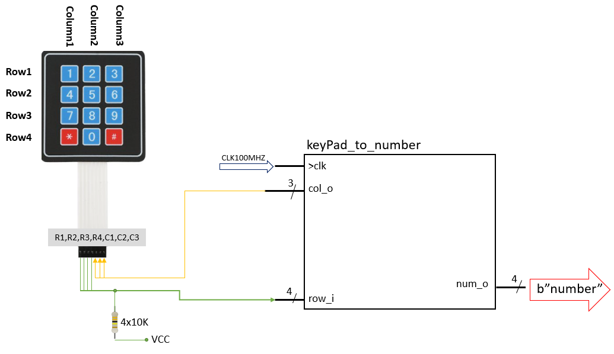
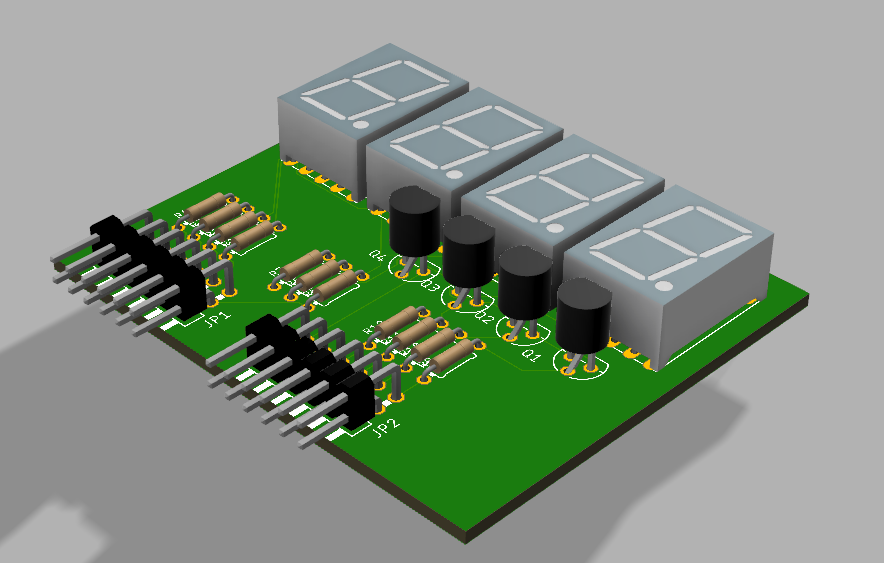

# Door lock system with PIN (4-digit) terminal, 4x3 push buttons, 4-digit 7-segment display, relay for door lock control.

### Team members
* Bohuslav Šotola
* Tomáš Škurla
* Barbora Šimková
* Filip Šišolák

Github repository link : https://github.com/xsisol01/Digital-electronics-1/tree/main/Labs

### Project objectives
The scope of this project was to create the lock system utilizing an Arty A7-100T board. The project, as per the initial assignment, consists of a 4x3 keypad, a 4-digit 7segment display, and a relay to control the door lock. We also implemented a Three-color-LED whose colors represent each state of the door ( Green for Opened, Red for Closed). The 4-digit 7 segment display is located on a breadboard connected to the board via Pmod connectors.

### Hardware description
Hardware used in this project:
* Arty A7-100T board (https://www.robotshop.com/eu/en/arty-a7-100t-artix-7-fpga-development-board.html)
* Pmod SSR: Solid State Relay Electronic Switch (https://store.digilentinc.com/pmod-ssr-solid-state-relay-electronic-switch/)
* Membrane 3x4 Matrix Keypad (https://www.adafruit.com/product/419)
* Custom 4 Digit 7 segment module 


#### Theoretical imagine of all of modules connected together 


### VHDL modules description and simulations
* [4x3 KeyPad control module](https://github.com/xsisol01/Digital-electronics-1/tree/main/Labs/Project#keypad-control-module) 
* [Relay control module](https://github.com/xsisol01/Digital-electronics-1/tree/main/Labs/Project#relay---vhdl)
* [7seg display control module](https://github.com/xsisol01/Digital-electronics-1/tree/main/Labs/Project#driver-for-multiple-seven-segment-displays)
* [Lock logic module](https://github.com/xsisol01/Digital-electronics-1/tree/main/Labs/Project#lock-logic-module)


## KeyPad control module
### Description
Module "keypad_to_num" for controlling 4x3 keypad contains from 3 input ports -> clk (needed to control state machine), reset (which is not needed in this case, but we are using template from previous labs), row_i (where comes the inforamtion which key was pressed). There are also 2 output ports -> col_o (sending sequention of 0 and 1 to the keypad columns) and finally the num_o (which send bin signal representing pressed key on keypad).
Keypad_to_num works on basis of state machine where each state change to another after defined time.
Each key represent bin signal - same as the label of the button on keypad for example 7 means b"0111". All other combinations are in table.

##### Functionality 


##### Table - Key pressed on keypad => num_o
| Key | num_o | Value |
| :-: | :-: | :-: | 
| 0 | b"0000" | 0 | 
| 1 | b"0001" | 1 | 
| 2 | b"0010" | 2 | 
| 3 | b"0011" | 3 | 
| 4 | b"0100" | 4 | 
| 5 | b"0101" | 5 | 
| 6 | b"0110" | 6 | 
| 7 | b"0111" | 7 | 
| 8 | b"1000" | 8 |  
| 9 | b"1001" | 9 | 
| * | b"1110" | DELETE | 
| # | b"1111" | ENTER |
| N/A | b"1101" | DEFAULT | 

##### State diagram 


### VHDL code and simulation
##### VHDL code of KeyPad controller - `keypad_to_num.vhdl`

```vhdl
library ieee;
use ieee.std_logic_1164.all;
use ieee.numeric_std.all;

------------------------------------------------------------------------
-- Entity declaration for traffic light controller
------------------------------------------------------------------------
entity keypad_to_num is
    port(
        clk         : in  std_logic;
        reset       : in  std_logic;
        row_i       : in  std_logic_vector(4 - 1 downto 0);     -- input from keypad
        
        col_o       : out std_logic_vector(3 - 1 downto 0);     -- output to keypad
        num_o       : out std_logic_vector(4 - 1 downto 0)      --Output signal with 4bit number 0-9, enter, delete
        
    );
end entity keypad_to_num;

------------------------------------------------------------------------
-- Architecture declaration for traffic light controller
------------------------------------------------------------------------
architecture Behavioral of keypad_to_num is

    -- Define the states
    type t_state is (SET_COLH,      --after reset
                     SET_COL1,
                     SET_COL2,
                     SET_COL3
                     );
        
    -- Define the signal that uses different states
    signal s_state  : t_state;
    -- Internal clock enable
    signal s_en     : std_logic; --not needed in this case
    -- Local delay counter
    signal   s_cnt  : unsigned(5 - 1 downto 0);
   
   
    constant c_DELAY_100ms : unsigned(5 - 1 downto 0) := b"0_0010"; --one pulse every 100ms
    constant c_ZERO        : unsigned(5 - 1 downto 0) := b"0_0000";


begin


    clk_en0 : entity work.clock_enable
        generic map(
            g_MAX => 5000000       -- g_MAX = 50 ms / (1/100 MHz) 
        )
        port map(
            clk   => clk,
            reset => reset,
            ce_o  => s_en
        );

    --Process sensitive to clock change, defining state machine rules
    p_in_to_num_out : process(clk)
    begin
        if rising_edge(clk) then
            if (reset = '1') then          -- Synchronous reset
                s_state <= SET_COLH ;      -- Set initial state
                --s_cnt <= c_ZERO;

            elsif (s_en = '1') then
            
                case s_state is
                    when SET_COLH =>
                        if (s_cnt < c_DELAY_100ms) then
                            s_cnt <= s_cnt + 1;   
                        else
                            s_state <= SET_COL1;
                            s_cnt <= c_ZERO;
                        end if;
                        
                    when SET_COL1 =>
                        if (s_cnt < c_DELAY_100ms) then
                            s_cnt <= s_cnt + 1;
                        else
                            s_state <= SET_COL2;
                            s_cnt <= c_ZERO;
                       end if;
                           
                    when SET_COL2 =>
                        if (s_cnt < c_DELAY_100ms) then
                            s_cnt <= s_cnt + 1; 
                        else
                            s_state <= SET_COL3;
                            s_cnt <= c_ZERO;
                        end if;
                        
                    when SET_COL3 =>
                        if (s_cnt < c_DELAY_100ms) then
                            s_cnt <= s_cnt + 1; 
                        else
                            s_state <= SET_COL1;
                            s_cnt <= c_ZERO;
                        end if; 
                           
                    when others =>
                        s_state <= SET_COLH;                   
               end case;            
            end if; -- Synchronous reset
        end if; -- Rising edge
    end process p_in_to_num_out;

    --Process senstitive on current state and setting output to columns
    p_output_statechanger : process(s_state)
    begin
        case s_state is
            when SET_COLH =>
                col_o <= "111";   
            when SET_COL1 =>
                col_o <= "011";    
            when SET_COL2 =>
                col_o <= "101";     
            when SET_COL3 =>
                col_o <= "110";
            when others =>
                col_o <= "111";
        end case;
    end process p_output_statechanger;
    
    
    --Process sensitive to row_i changes and setting output based on current state
    p_output_row_check_out : process(row_i)
    begin
        case s_state is
            when SET_COLH =>
                num_o <= "1101";                -- default
                
            when SET_COL1 =>
                if(row_i = "0111") then
                    num_o <= "0001";            --set output 1 - pressed
                               
                elsif(row_i = "1011") then  
                    num_o <= "0100";            --set output 4 - pressed
                                
                elsif(row_i = "1101") then  
                    num_o <= "0111";            --set output 7 - pressed  
                                
                elsif(row_i = "1110") then  
                    num_o <= "1110";            --set output *(delete) - pressed
                else 
                    num_o <= "1101";            --defult            
                end if;
                
            when SET_COL2 =>
                if(row_i = "0111") then
                    num_o <= "0010";            --set output 2 - pressed
                            
                elsif(row_i = "1011") then  
                    num_o <= "0101";            --set output 5 - pressed
                            
                elsif(row_i = "1101") then  
                     num_o <= "1000";           --set output 8 - pressed  
                            
                elsif(row_i = "1110") then  
                     num_o <= "0000";           --set output 0 - pressed 
                else 
                     num_o <= "1101";           --defult no output          
                end if;
                
            when SET_COL3 =>
                if(row_i = "0111") then
                     num_o <= "0011";           --set output 3 - pressed
                                
                elsif(row_i = "1011") then  
                     num_o <= "0110";           --set output 6 - pressed
                                
                elsif(row_i = "1101") then  
                       num_o <= "1001";         --set output 9 - pressed  
                                
                elsif(row_i = "1110") then  
                       num_o <= "1111";         --set output #(enter) - pressed
                else 
                     num_o <= "1101";           --defult         
                end if; 
                
            when others =>
                num_o <= "1101";
          end case;
      end process p_output_row_check_out;  
end architecture Behavioral;
```

##### Simulation of KeyPad controller - `tb_keypad_to_num.vhdl`

```vhdl
library ieee;
use ieee.std_logic_1164.all;


entity tb_keypad_to_num is
    -- Entity of testbench is always empty
end entity tb_keypad_to_num;

architecture testbench of tb_keypad_to_num is

    -- Local constants
    constant c_CLK_100MHZ_PERIOD : time := 10 ns;

    --Local signals
    signal s_clk_100MHz : std_logic;
    signal s_reset      : std_logic;
    signal s_row        : std_logic_vector(4 - 1 downto 0);
    signal s_col        : std_logic_vector(3 - 1 downto 0);
    signal s_num        : std_logic_vector(4 - 1 downto 0);

begin

    uut_tlc : entity work.keypad_to_num
        port map(
            clk     => s_clk_100MHz,
            reset   => s_reset, 
            row_i   => s_row,
            col_o   => s_col,
            num_o   => s_num
        );


    p_clk_gen : process
    begin
        while now < 800 ms loop   
            s_clk_100MHz <= '0';
            wait for c_CLK_100MHZ_PERIOD / 2;
            s_clk_100MHz <= '1';
            wait for c_CLK_100MHZ_PERIOD / 2;
        end loop;
        wait;
    end process p_clk_gen;

    p_stimulus : process
    begin
    
        s_row <= "1111";  
        wait for 57 ms;
    
        s_row <= "0111";
        wait for 50 ms; 
        
        s_row <= "1111";  
        wait for 157 ms; 
        
        s_row <= "1101";
        wait for 52 ms;
        
        s_row <= "1111";  
        wait for 157 ms; 
        
        s_row <= "1011";
        wait for 52 ms;
        
        
        s_row <= "1111";  
        wait;
    end process p_stimulus;

end architecture testbench;  
```

##### Image of simulation waveforms - simulating KeyPad controller module


## Relay control module
### Description
Add Text here

### Functionality 


### State Diagram


### VHDL code and simulation
#### VHDL code of Relay controller - `relay_to_door.vhdl`

```vhdl
library ieee;
use ieee.std_logic_1164.all;
use ieee.numeric_std.all;


entity relay_to_door is
    port(
       keypad_i     : in  std_logic;
        clk          : in  std_logic;
        reset        : in  std_logic;
        
        door_o      : out  std_logic; 
        LED_o : out std_logic_vector(3 - 1 downto 0)


    );
end entity relay_to_door;


architecture Behavioral of relay_to_door is

                
    type   t_state is (close_door, open_door);                   
    signal s_state  : t_state;


   
    signal s_en             : std_logic;
    signal s_keypad         : std_logic;
    
    
    signal   s_cnt  : unsigned(5 - 1 downto 0);

    
    constant c_DELAY_7SEC : unsigned(5 - 1 downto 0) := b"1_1100";
    constant c_DELAY_3SEC : unsigned(5 - 1 downto 0) := b"0_1100";
    constant c_DELAY_1SEC : unsigned(5 - 1 downto 0) := b"0_0100";
    constant c_ZERO       : unsigned(5 - 1 downto 0) := b"0_0000";
    


begin
    
    s_en <= '1';


 p_state_changer : process(clk,reset,keypad_i)
    begin
        if rising_edge(clk) then
            if (reset = '1') then     
                s_state <= close_door ;     
                s_cnt <= c_ZERO;

            elsif (s_en = '1') then
            
                case s_state is
                    when close_door =>
                        if (keypad_i = '1') then
                            s_state <= open_door;
                            s_cnt   <= c_ZERO;  
                        else
                            s_state <= close_door;
                            s_cnt <= c_ZERO;
                        end if;
                        
                    when open_door =>
                        if (s_cnt < c_DELAY_7SEC) then
                            s_cnt <= s_cnt + 1;
                        else
                            s_state <= close_door;
                            s_cnt <= c_ZERO;
                       end if;
                                  
                    when others =>
                        s_state <= close_door;                   
               end case;            
            end if;
        end if; 
    end process p_state_changer;


    p_output_door : process(s_state)
    begin
        case s_state is
        
 
            when close_door =>
                LED_o <= "100";
                door_o <='0';
                
            when open_door =>
                LED_o <= "010";   
                door_o <='1';
           
        end case;
    end process p_output_door;
    
    
 
end architecture Behavioral;

```


#### Simulation of Relay control

```vhdl
library ieee;
use ieee.std_logic_1164.all;


entity tb_relay_to_door is
    -- Entity of testbench is always empty
end entity tb_relay_to_door;


architecture testbench of tb_relay_to_door is

    constant c_CLK_100MHZ_PERIOD : time := 10 ns;

    --Local signals
    signal s_clk_100MHz : std_logic;
    signal s_reset      : std_logic;
    signal s_keypad         : std_logic;
    
    signal s_LED      : std_logic_vector(3 - 1 downto 0);


begin
    uut_relay_to_door : entity work.relay_to_door
        port map(
            clk     => s_clk_100MHz,
            reset   => s_reset,
            keypad_i =>s_keypad,
            LED_o => s_LED

        );


    p_clk_gen : process
    begin
        while now < 10000 ns loop 
            s_clk_100MHz <= '0';
            wait for c_CLK_100MHZ_PERIOD / 2;
            s_clk_100MHz <= '1';
            wait for c_CLK_100MHZ_PERIOD / 2;
        end loop;
        wait;
    end process p_clk_gen;


    p_reset_gen : process
    begin
        s_reset <= '0';
        s_keypad <= '1'; wait for 200ns;
        s_keypad <= '0';wait for 100ns;
        s_keypad <= '1';
        wait;
    end process p_reset_gen;


    p_stimulus : process
    begin
        
        wait;
    end process p_stimulus;

end architecture testbench;

```
#### Image of simulation waveforms


## Driver for multiple seven-segment displays

### Schematic of `driver_7seg_4digits` with connection to four 7 segment displays


### Schematic of four 7 segment displays with connection to Arty-A7-100T


### Board for four 7 segment displays




### Table with connection of four 7 segment displays to Arty-A7-100T

**Pmod JB**

| Pmod JB | Connection | Cathodes |
| :-----: | :--------: | :------: |
|  Pin 1  |    E15     |    CA    |
|  Pin 2  |    E16     |    CB    |
|  Pin 3  |    D15     |    CC    |
|  Pin 4  |    C15     |    CD    |
|  Pin 7  |    J17     |    CE    |
|  Pin 8  |    J18     |    CF    |
|  Pin 9  |    K15     |    CG    |
| Pin 10  |    J15     |    DP    |

**Pmod JC**

| Pmod JC | Connection | Anodes |
| :-----: | :--------: | :----: |
|  Pin 1  |    U12     |  AN0   |
|  Pin 2  |    V12     |  AN1   |
|  Pin 3  |    V10     |  AN2   |
|  Pin 4  |    V11     |  AN3   |
|  Pin 7  |    U14     |   -    |
|  Pin 8  |    V14     |   -    |
|  Pin 9  |    T13     |   -    |
| Pin 10  |    U13     |   -    |

### Driver for 7 segment displays

##### VHDL code of Relay controller - `driver_7seg_4digits.vhdl`

```vhdl
------------------------------------------------------------------------
--
-- Copyright (c) 2020 Tomas Fryza
-- Dept. of Radio Electronics, Brno University of Technology, Czechia
-- This work is licensed under the terms of the MIT license.
--
------------------------------------------------------------------------

library ieee;
use ieee.std_logic_1164.all;
use ieee.numeric_std.all;

------------------------------------------------------------------------
-- Entity declaration for display driver
------------------------------------------------------------------------
entity driver_7seg_4digits is
    port(
        clk     : in  std_logic;        -- Main clock
        reset   : in  std_logic;        -- Synchronous reset
        -- 4-bit input values for individual digits
        data0_i : in  std_logic_vector(4 - 1 downto 0);
        data1_i : in  std_logic_vector(4 - 1 downto 0);
        data2_i : in  std_logic_vector(4 - 1 downto 0);
        data3_i : in  std_logic_vector(4 - 1 downto 0);
        -- Cathode values for individual segments
        seg_o   : out std_logic_vector(7 - 1 downto 0);
        -- Common anode signals to individual displays
        dig_o   : out std_logic_vector(4 - 1 downto 0)
    );
end entity driver_7seg_4digits;

------------------------------------------------------------------------
-- Architecture declaration for display driver
------------------------------------------------------------------------
architecture Behavioral of driver_7seg_4digits is

    -- Internal clock enable
    signal s_en  : std_logic;
    -- Internal 2-bit counter for multiplexing 4 digits
    signal s_cnt : std_logic_vector(2 - 1 downto 0);
    -- Internal 4-bit value for 7-segment decoder
    signal s_hex : std_logic_vector(4 - 1 downto 0);

begin
    --------------------------------------------------------------------
    -- Instance (copy) of clock_enable entity generates an enable pulse
    -- every 4 ms
    clk_en0 : entity work.clock_enable
        generic map(
        g_MAX => 4
            --- WRITE YOUR CODE HERE
        )
        port map(
         clk    => clk, 
         reset  => reset,
         ce_o   => s_en 
            --- WRITE YOUR CODE HERE
        );

    --------------------------------------------------------------------
    -- Instance (copy) of cnt_up_down entity performs a 2-bit down
    -- counter
    bin_cnt0 : entity work.cnt_up_down
        generic map(
        g_CNT_WIDTH => 2
            --- WRITE YOUR CODE HERE
        )
        port map(
        clk         => clk,   
        reset       => reset,   
        en_i        => s_en,  
        cnt_up_i    => '0',
        cnt_o       => s_cnt
            --- WRITE YOUR CODE HERE
        );

    --------------------------------------------------------------------
    -- Instance (copy) of hex_7seg entity performs a 7-segment display
    -- decoder
    hex2seg : entity work.hex_7seg
        port map(
            hex_i => s_hex,
            seg_o => seg_o
        );

    --------------------------------------------------------------------
    -- p_mux:
    -- A combinational process that implements a multiplexer for
    -- selecting data for a single digit, a decimal point signal, and 
    -- switches the common anodes of each display.
    --------------------------------------------------------------------
    p_mux : process(s_cnt, data0_i, data1_i, data2_i, data3_i)
    begin
        case s_cnt is
            when "11" =>
                s_hex <= data3_i;
                dig_o <= "0111";

            when "10" =>
                s_hex <= data2_i;
                dig_o <= "1011";

            when "01" =>
                s_hex <= data1_i;
                dig_o <= "1101";

            when others =>
                s_hex <= data0_i;
                dig_o <= "1110";
        end case;
    end process p_mux;

end architecture Behavioral;
```
### Testbench of driver for 7 segment displays
##### `tb_driver_7seg_4digits`
```vhdl
------------------------------------------------------------------------
--
-- Template for 4-digit 7-segment display driver testbench.
-- Nexys A7-50T, Vivado v2020.1.1, EDA Playground
--
-- Copyright (c) 2020 Tomas Fryza
-- Dept. of Radio Electronics, Brno University of Technology, Czechia
-- This work is licensed under the terms of the MIT license.
--
------------------------------------------------------------------------

library ieee;
use ieee.std_logic_1164.all;

------------------------------------------------------------------------
-- Entity declaration for testbench
------------------------------------------------------------------------
entity tb_driver_7seg_4digits is
    -- Entity of testbench is always empty
end entity tb_driver_7seg_4digits;

------------------------------------------------------------------------
-- Architecture body for testbench
------------------------------------------------------------------------
architecture testbench of tb_driver_7seg_4digits is

    -- Local constants
    constant c_CLK_100MHZ_PERIOD : time    := 10 ns;

    --Local signals
    signal s_clk_100MHz   : std_logic;
    signal s_reset        : std_logic;
    signal s_data0_i      : std_logic_vector(4 - 1 downto 0);
    signal s_data1_i      : std_logic_vector(4 - 1 downto 0);
    signal s_data2_i      : std_logic_vector(4 - 1 downto 0);
    signal s_data3_i      : std_logic_vector(4 - 1 downto 0);     
    signal s_seg_o        : std_logic_vector(7 - 1 downto 0);  
    signal s_dig_o        : std_logic_vector(4 - 1 downto 0);   


begin
    -- Connecting testbench signals with driver_7seg_4digits entity
    -- (Unit Under Test)
    uut_driver_7seg : entity work.driver_7seg_4digits
        port map (
        clk         => s_clk_100MHz,
        reset       => s_reset,
        data0_i     => s_data0_i,
        data1_i     => s_data1_i,
        data2_i     => s_data2_i,
        data3_i     => s_data3_i,  
        seg_o       => s_seg_o,
        dig_o       => s_dig_o
        );
        
    --------------------------------------------------------------------
    -- Clock generation process
    --------------------------------------------------------------------
    p_clk_gen : process
    begin
        while now < 750 ns loop         -- 75 periods of 100MHz clock
            s_clk_100MHz <= '0';
            wait for c_CLK_100MHZ_PERIOD / 2;
            s_clk_100MHz <= '1';
            wait for c_CLK_100MHZ_PERIOD / 2;
        end loop;
        wait;
    end process p_clk_gen;

    --------------------------------------------------------------------
    -- Reset generation process
    --------------------------------------------------------------------
     p_reset_gen : process
    begin
        s_reset <= '0';
        wait for 10 ns;
        
        -- Reset activated
        s_reset <= '1';
        wait for 53 ns;

        s_reset <= '0';
        wait;
    end process p_reset_gen;

    --------------------------------------------------------------------
    -- Data generation process
    --------------------------------------------------------------------
    p_stimulus : process
    begin
        report "Stimulus process started" severity note;
        
        s_data3_i <= "0011";
        s_data2_i <= "0001";   
        s_data1_i <= "0100";
        s_data0_i <= "0010";
        
        wait for 600 ns;
            -- Expected output
        	assert ((s_seg_o = "0000110") and (s_dig_o = "0111"))
        	-- If false, then report an error
        	report "Test failed for input on 600ns" severity error;
        
        s_data3_i <= "0000";
        s_data2_i <= "0001";   
        s_data1_i <= "0000";
        s_data0_i <= "0001";
        
        wait for 150 ns;
            -- Expected output
        	assert ((s_seg_o = "1001111") and (s_dig_o = "1110"))
        	-- If false, then report an error
        	report "Test failed for input on 750ns" severity error;
        	
        s_data3_i <= "0001";
        s_data2_i <= "0010";   
        s_data1_i <= "0011";
        s_data0_i <= "0100";

        report "Stimulus process finished" severity note;
        wait;
    end process p_stimulus;

end architecture testbench;
```
##### `hex_7seg`
**Decoder truth table for common anode 7-segment display:**

| **Hex** | **Inputs** | **A** | **B** | **C** | **D** | **E** | **F** | **G** |
| :-: | :-: | :-: | :-: | :-: | :-: | :-: | :-: | :-: |
| 0 | 0000 | 0 | 0 | 0 | 0 | 0 | 0 | 1 |
| 1 | 0001 | 1 | 0 | 0 | 1 | 1 | 1 | 1 |
| 2 | 0010 | 0 | 0 | 1 | 0 | 0 | 1 | 0 |
| 3 | 0011 | 0 | 0 | 0 | 0 | 1 | 1 | 0 |
| 4 | 0100 | 1 | 0 | 0 | 1 | 1 | 0 | 0 |
| 5 | 0101 | 0 | 1 | 0 | 0 | 1 | 0 | 0 |
| 6 | 0110 | 0 | 1 | 0 | 0 | 0 | 0 | 0 |
| 7 | 0111 | 0 | 0 | 0 | 1 | 1 | 1 | 1 |
| 8 | 1000 | 0 | 0 | 0 | 0 | 0 | 0 | 0 |
| 9 | 1001 | 0 | 0 | 0 | 0 | 1 | 0 | 0 |
| A | 1010 | 0 | 0 | 0 | 1 | 0 | 0 | 0 |
| b | 1011 | 1 | 1 | 0 | 0 | 0 | 0 | 0 |
| C | 1100 | 0 | 1 | 1 | 0 | 0 | 0 | 1 |
| d | 1101 | 1 | 1 | 1 | 1 | 1 | 1 | 1 |
| E | 1110 | 0 | 1 | 1 | 0 | 0 | 0 | 0 |
| F | 1111 | 0 | 1 | 1 | 1 | 0 | 0 | 0 |
```vhdl
----------------------------------------------------------------------------------
-- Company: 
-- Engineer: 
-- 
-- Create Date: 03.03.2021 13:13:50
-- Design Name: 
-- Module Name: hex_7seg - Behavioral
-- Project Name: 
-- Target Devices: 
-- Tool Versions: 
-- Description: 
-- 
-- Dependencies: 
-- 
-- Revision:
-- Revision 0.01 - File Created
-- Additional Comments:
-- 
----------------------------------------------------------------------------------


library IEEE;
use IEEE.STD_LOGIC_1164.ALL;

-- Uncomment the following library declaration if using
-- arithmetic functions with Signed or Unsigned values
--use IEEE.NUMERIC_STD.ALL;

-- Uncomment the following library declaration if instantiating
-- any Xilinx leaf cells in this code.
--library UNISIM;
--use UNISIM.VComponents.all;

entity hex_7seg is
    Port ( 
        hex_i : in STD_LOGIC_VECTOR (4 - 1 downto 0);
        seg_o : out STD_LOGIC_VECTOR (7 - 1 downto 0)
        );
end hex_7seg;

architecture Behavioral of hex_7seg is

begin

    --------------------------------------------------------------------
    -- p_7seg_decoder:
    -- A combinational process for 7-segment display decoder. 
    -- Any time "hex_i" is changed, the process is "executed".
    -- Output pin seg_o(6) corresponds to segment A, seg_o(5) to B, etc.
    --------------------------------------------------------------------
    
    p_7seg_decoder : process(hex_i)
    begin
        case hex_i is
            when "0000" =>
                seg_o <= "0000001";     -- 0
            when "0001" =>
                seg_o <= "1001111";     -- 1
             when "0010" =>
                seg_o <= "0010010";     -- 2
             when "0011" =>
                seg_o <= "0000110";     -- 3
             when "0100" =>
                seg_o <= "1001100";     -- 4
             when "0101" =>
                seg_o <= "0100100";     -- 5
             when "0110" =>
                seg_o <= "0100000";     -- 6
             when "0111" =>
                seg_o <= "0001111";     -- 7  
             when "1000" =>
                seg_o <= "0000000";     -- 8
             when "1001" =>
                seg_o <= "0000100";     -- 9
             when "1010" =>
                seg_o <= "0001000";     -- A
             when "1011" =>
                seg_o <= "1100000";     -- b
             when "1100" =>
                seg_o <= "0110001";     -- C
             when "1101" =>
                seg_o <= "1111111";     -- d
            when "1110" =>
                seg_o <= "0110000";     -- E
            when others =>
                seg_o <= "0111000";     -- F
        end case;
    end process p_7seg_decoder;

end Behavioral;

```
##### `clock_enable`

```vhdl
------------------------------------------------------------------------
--
-- Generates clock enable signal.
-- Nexys A7-50T, Vivado v2020.1.1, EDA Playground
--
-- Copyright (c) 2019-Present Tomas Fryza
-- Dept. of Radio Electronics, Brno University of Technology, Czechia
-- This work is licensed under the terms of the MIT license.
--
------------------------------------------------------------------------

library ieee;               -- Standard library
use ieee.std_logic_1164.all;-- Package for data types and logic operations
use ieee.numeric_std.all;   -- Package for arithmetic operations

------------------------------------------------------------------------
-- Entity declaration for clock enable
------------------------------------------------------------------------
entity clock_enable is
    generic(
        g_MAX : natural := 30       -- Number of clk pulses to generate
                                    -- one enable signal period
    );  -- Note that there IS a semicolon between generic and port
        -- sections
    port(
        clk   : in  std_logic;      -- Main clock
        reset : in  std_logic;      -- Synchronous reset
        ce_o  : out std_logic       -- Clock enable pulse signal
    );
end entity clock_enable;

------------------------------------------------------------------------
-- Architecture body for clock enable
------------------------------------------------------------------------
architecture Behavioral of clock_enable is

    -- Local counter
    signal s_cnt_local : natural;

begin
    --------------------------------------------------------------------
    -- p_clk_ena:
    -- Generate clock enable signal. By default, enable signal is low 
    -- and generated pulse is always one clock long.
    --------------------------------------------------------------------
    p_clk_ena : process(clk)
    begin
        if rising_edge(clk) then        -- Synchronous process

            if (reset = '1') then       -- High active reset
                s_cnt_local <= 0;       -- Clear local counter
                ce_o        <= '0';     -- Set output to low

            -- Test number of clock periods
            elsif (s_cnt_local >= (g_MAX - 1)) then
                s_cnt_local <= 0;       -- Clear local counter
                ce_o        <= '1';     -- Generate clock enable pulse

            else
                s_cnt_local <= s_cnt_local + 1;
                ce_o        <= '0';
            end if;
        end if;
    end process p_clk_ena;

end architecture Behavioral;
```

##### `cnt_up_down`

```vhdl
------------------------------------------------------------------------
--
-- N-bit Up/Down binary counter.
-- Nexys A7-50T, Vivado v2020.1.1, EDA Playground
--
-- Copyright (c) 2019-Present Tomas Fryza
-- Dept. of Radio Electronics, Brno University of Technology, Czechia
-- This work is licensed under the terms of the MIT license.
--
------------------------------------------------------------------------

library ieee;
use ieee.std_logic_1164.all;
use ieee.numeric_std.all;

------------------------------------------------------------------------
-- Entity declaration for n-bit counter
------------------------------------------------------------------------
entity cnt_up_down is
    generic(
        g_CNT_WIDTH : natural := 4      -- Number of bits for counter
    );
    port(
        clk      : in  std_logic;       -- Main clock
        reset    : in  std_logic;       -- Synchronous reset
        en_i     : in  std_logic;       -- Enable input
        cnt_up_i : in  std_logic;       -- Direction of the counter
        cnt_o    : out std_logic_vector(g_CNT_WIDTH - 1 downto 0)
    );
end entity cnt_up_down;

------------------------------------------------------------------------
-- Architecture body for n-bit counter
------------------------------------------------------------------------
architecture behavioral of cnt_up_down is

    -- Local counter
    signal s_cnt_local : unsigned(g_CNT_WIDTH - 1 downto 0);

begin
    --------------------------------------------------------------------
    -- p_cnt_up_down:
    -- Clocked process with synchronous reset which implements n-bit 
    -- up/down counter.
    --------------------------------------------------------------------
    p_cnt_up_down : process(clk)
    begin
        if rising_edge(clk) then
        
            if (reset = '1') then               -- Synchronous reset
                s_cnt_local <= (others => '0'); -- Clear all bits

            elsif (en_i = '1') then       -- Test if counter is enabled

                -- TEST COUNTER DIRECTION HERE
                if(cnt_up_i = '1') then
                     s_cnt_local <= s_cnt_local + 1;
                else
                     s_cnt_local <= s_cnt_local -1;
                end if;
            end if;
        end if;
    end process p_cnt_up_down;

    -- Output must be retyped from "unsigned" to "std_logic_vector"
    cnt_o <= std_logic_vector(s_cnt_local);

end architecture behavioral;

```
##### Simulation


### Lock logic module
some information

##### Block scheme


##### State diagram


##### VHDL code of Lock logic module - `locker_logic.vhdl`

```vhdl
library IEEE;
use IEEE.STD_LOGIC_1164.ALL;
use ieee.numeric_std.all;

-- Uncomment the following library declaration if using
-- arithmetic functions with Signed or Unsigned values
--use IEEE.NUMERIC_STD.ALL;

-- Uncomment the following library declaration if instantiating
-- any Xilinx leaf cells in this code.
--library UNISIM;
--use UNISIM.VComponents.all;

entity locker_logic is
    Port (
        clk         : in std_logic;
        reset       : in std_logic;
        num_i       : in std_logic_vector( 4 - 1 downto 0);     -- input value from keypad controler
         
        data0_o     : out std_logic_vector( 4 - 1 downto 0);    --output value for 1st display of 4dig 7 segment module
        data1_o     : out std_logic_vector( 4 - 1 downto 0);    --output value for 2nd display of 4dig 7 segment module
        data2_o     : out std_logic_vector( 4 - 1 downto 0);    --output value for 3rd display of 4dig 7 segment module
        data3_o     : out std_logic_vector( 4 - 1 downto 0);    --output value for 4th display of 4dig 7 segment module
        
        relay_o     : out std_logic     -- value 1/0 for relay module to open/lock
     );
end locker_logic;

architecture Behavioral of locker_logic is

    -- define the password, for this case PW is 1234 
    constant NUM1_PW : std_logic_vector(4 - 1 downto 0) := "0001";
    constant NUM2_PW : std_logic_vector(4 - 1 downto 0) := "0010";
    constant NUM3_PW : std_logic_vector(4 - 1 downto 0) := "0011";
    constant NUM4_PW : std_logic_vector(4 - 1 downto 0) := "0100";
    
    -- State definition
    -------------------------------
    type t_stateLO is ( LOCKED,
                        OPENED
                       );
                       
    type t_stateNUM is (NUM0, -- after reset
                        NUM1,
                        NUM2,
                        NUM3,
                        NUM4
                        
                       );
                       
    -- Define the signals that uses different states                   
    signal s_stateLO            : t_stateLO;
    signal s_stateNUM           : t_stateNUM;
    
    -- Signal for pw reset 
    signal s_password_reset     : std_logic;
  
    -- signals which are setted to '1' after correct number selected
    signal s_num1_corr      : std_logic;
    signal s_num2_corr      : std_logic;
    signal s_num3_corr      : std_logic;
    signal s_num4_corr      : std_logic;
    
    -- signals wich number was selected
    signal s_num1_displ     : std_logic_vector( 4 - 1 downto 0);
    signal s_num2_displ     : std_logic_vector( 4 - 1 downto 0);
    signal s_num3_displ     : std_logic_vector( 4 - 1 downto 0);
    signal s_num4_displ     : std_logic_vector( 4 - 1 downto 0);
       
begin

    clk_en0 : entity work.clock_enable
        generic map(
            g_MAX => 5000000       -- g_MAX = 50 ms / (1/100 MHz) 
        )
        port map(
            clk   => clk,
            reset => reset   
        );
    
      
    -- process sensitive to num_i, reset, s_password_reset changes
    -- changing states
    p_stateNUM_changer : process(num_i,reset, s_password_reset)
    begin 
        if (s_password_reset = '1' or reset = '1') then 
            s_stateNUM <= NUM0;
            
            s_password_reset <= '0';
       else
            case s_stateNUM is
            
                when NUM0 =>                    --after reset 
                    if( num_i = "1101") then    -- when input from keypad is d - default staying in same state
                        s_stateNUM <= NUM0;                        
                    else                        -- else going to another
                        s_stateNUM <= NUM1;                           
                    end if;
                    
                when NUM1 =>
                    if( num_i = "1101") then
                        s_stateNUM <= NUM1;
                    else
                        s_stateNUM <= NUM2;                             
                    end if;
                    
                when NUM2 =>
                    if( num_i = "1101") then
                        s_stateNUM <= NUM2;
                    else  
                        s_stateNUM <= NUM3;                             
                    end if;
                    
                when NUM3 =>
                    if( num_i = "1101") then
                        s_stateNUM <= NUM3;
                    else
                        s_stateNUM <= NUM4;                             
                    end if;
                    
                when NUM4 =>
                    if( num_i = "1101") then
                        s_password_reset <= '1';    --auto reset after NUM4                           
                    end if;
          
                when others => 
                    s_stateNUM <= NUM0;             -- default state NUM0
            end case;  --stateNUM 
         end if;  
    end process p_stateNUM_changer;
    
    
    -- Process sensitive to s_stateNUM, s_num4_corr, s_num1_displ, s_num2_displ, s_num3_displ, s_num4_displ changes
    -- Checking if all numbers were selected corecctly and opening the relay
    -- Also working with display info
    p_correct_signal_changer : process (s_stateNUM, s_num4_corr, s_num1_displ, s_num2_displ, s_num3_displ, s_num4_displ)
    begin
        case s_stateNUM is 
        
           when NUM1 =>
               data3_o <= "1101";           -- defaultly giving output for display of previous state to default
               s_num1_displ <= num_i;       -- assigment of input information to signal 
               data0_o <= s_num1_displ;     -- ouputin input inforamtion to display 
               
               if(num_i = NUM1_PW) then 
                   s_num1_corr <= '1';    
               end if; 
               
           when NUM2 =>
               data0_o <= "1101";
               s_num2_displ <= num_i;
               data1_o <= s_num2_displ;
               
               if(num_i = NUM2_PW) then 
                   s_num2_corr <= '1';
                 
               end if; 
                    
           when NUM3 =>
               data1_o <= "1101";
               s_num3_displ <= num_i;
               data2_o <= s_num3_displ;
               
               if(num_i = NUM3_PW) then 
                   s_num3_corr <= '1';
               end if;
                   
           when NUM4 =>
               data2_o <= "1101";
               s_num4_displ <= num_i;
               data3_o <= s_num4_displ;
           
               if(num_i = NUM4_PW) then 
                   s_num4_corr <= '1';
                   if ( s_num1_corr = '1' and s_num2_corr = '1' and s_num3_corr = '1' and s_num4_corr = '1') then 
                       s_stateLO <= OPENED;
                   else
                       s_stateLO <= LOCKED;
                       
                   end if;
               end if;
    
          when others =>
               data0_o <= "1101";
               data1_o <= "1101";
               data2_o <= "1101";
               data3_o <= "1101";
               
               s_num1_displ <= "1101";
               s_num2_displ <= "1101";
               s_num3_displ <= "1101";
               s_num4_displ <= "1101";
               
               s_stateLO <= LOCKED;
               
               s_num1_corr <= '0';
               s_num2_corr <= '0';
               s_num3_corr <= '0';
               s_num4_corr <= '0';
            end case;

        
    end process p_correct_signal_changer;
    
    p_stateLO_defintion : process (clk)
    begin
        if rising_edge (clk) then
            case s_stateLO is 
            when LOCKED =>
                relay_o <= '0';
            when OPENED =>
                relay_o <= '1';
            when others =>
                relay_o <= '0';
            end case;
        end if;
    end process p_stateLO_defintion;
     
end Behavioral;
```

##### Simulation of lock logic - `tb_lock_logic.vhdl`

```vhdl
library IEEE;
use IEEE.STD_LOGIC_1164.ALL;
use ieee.numeric_std.all;

-- Uncomment the following library declaration if using
-- arithmetic functions with Signed or Unsigned values
--use IEEE.NUMERIC_STD.ALL;

-- Uncomment the following library declaration if instantiating
-- any Xilinx leaf cells in this code.
--library UNISIM;
--use UNISIM.VComponents.all;

entity tb_lock_logic is
--  Port ( );
end tb_lock_logic;
    
architecture testbench of tb_lock_logic is
    constant c_CLK_100MHZ_PERIOD : time := 1 ns;
    
    signal s_num    : std_logic_vector( 4 - 1 downto 0);
    signal s_reset  : std_logic; 
    signal s_clk_100MHZ : std_logic;
        
    signal s_data0  : std_logic_vector( 4 - 1 downto 0); 
    signal s_data1  : std_logic_vector( 4 - 1 downto 0);
    signal s_data2  : std_logic_vector( 4 - 1 downto 0); 
    signal s_data3  : std_logic_vector( 4 - 1 downto 0);
        
    signal s_relay  : std_logic;
begin
    
    uut_lock_logic  : entity work.locker_logic
        port map(
            num_i   => s_num,
            reset   => s_reset,
            data0_o => s_data0,
            data1_o => s_data1,
            data2_o => s_data2,
            data3_o => s_data3,
            relay_o => s_relay, 
            clk => s_CLK_100MHZ
        );
        
        
        p_clk_gen : process
    begin
        while now < 1000 ns loop   
            s_clk_100MHz <= '0';
            wait for c_CLK_100MHZ_PERIOD / 2;
            s_clk_100MHz <= '1';
            wait for c_CLK_100MHZ_PERIOD / 2;
        end loop;
        wait;
    end process p_clk_gen;
        
    p_stimulus : process
    begin
    
        s_num <= "1101";        --default keyboard output
        s_reset <= '1';
        wait for 14ns;
        
        s_reset <= '0';
        wait for 12ns;
        
        s_num <= "0001";        -- 1 to input
        wait for 12ns;
        
        s_num <= "1101";        --default keyboard output 
        wait for 20ns;
        
        s_num <= "0010";        -- 2 to input
        wait for 12ns;
        
        s_num <= "1101";        --default keyboard output
        wait for 20ns;
        
        s_num <= "0011";        -- 3 to input
        wait for 12ns;
        
        s_num <= "1101";        --default keyboard output
        wait for 20ns;
        
        s_num <= "0100";        -- 4 to input
        wait for 12ns;
        
        s_num <= "1101";        --default keyboard output
        wait for 26 ns;
                                --------- ALL numbers seted => again ---------      
        
        s_num <= "0111";        -- 7 to input
        wait for 12ns;
        
        s_num <= "1101";        --default keyboard output
        wait for 10ns;
        
        s_num <= "0101";        -- 5 to input
        wait for 12ns;
        
        s_num <= "1101";        --default keyboard output
        wait for 20ns;
        
        s_num <= "0011";        -- 3 to input 
        wait for 12ns;
        
        s_num <= "1101";        --default keyboard output
        wait for 20ns;
        
        s_num <= "0100";        -- 4 to input
        wait for 12ns;
        
        s_num <= "1101";        --default keyboard output
        wait;  
               
    end process p_stimulus;

end architecture testbench;
```
##### Image of simulation waveforms - simulating KeyPad controller module


## TOP module description and simulations

### Schematic of top


##### VHDL code of Top modul - `top.vhdl`
```vhdl
library IEEE;
use IEEE.STD_LOGIC_1164.ALL;


entity top is
  Port (
        CLK100MHZ    : in std_logic;
        ROW          : in std_logic_vector( 4 - 1 downto 0);
        SW           : in std_logic;
        
        COL          : out std_logic_vector( 3 - 1 downto 0);
        
        SEG_DISP     : out std_logic_vector ( 7 - 1 downto 0);
        
        DIG          : out std_logic_vector( 4 - 1 downto 0);
        LED          : out std_logic_vector( 3 - 1 downto 0);
        RELAY        : out std_logic
        
  
   );
end top;

architecture Behavioral of top is
    
    -- Signals to connect each module
    signal s_data0  : std_logic_vector( 4 - 1 downto 0);
    signal s_data1  : std_logic_vector( 4 - 1 downto 0);
    signal s_data2  : std_logic_vector( 4 - 1 downto 0);
    signal s_data3  : std_logic_vector( 4 - 1 downto 0);
    
    signal s_rel    : std_logic;
    signal s_num    : std_logic_vector ( 4 - 1 downto 0);
        
begin
    
    driver_seg_4 : entity work.driver_7seg_4digits
        port map(
            clk     => CLK100MHZ,
            reset   => SW,
            
            data0_i  => s_data0,
            data1_i  => s_data1,
            data2_i  => s_data2,
            data3_i  => s_data3,
            
            dig_o   => DIG,
            
            seg_o(6)   => SEG_DISP(6),
            seg_o(5)   => SEG_DISP(5),
            seg_o(4)   => SEG_DISP(4),
            seg_o(3)   => SEG_DISP(3),
            seg_o(2)   => SEG_DISP(2),
            seg_o(1)   => SEG_DISP(1),
            seg_o(0)   => SEG_DISP(0)   
        );
    
    keypad_to_num : entity work.keypad_to_num
        port map(
            clk     => CLK100MHZ,
            reset   => SW,
            
            col_o   => COL,
            row_i   => ROW,
            
            num_o   => s_num
        
        );
        
    locker_logic : entity work.locker_logic
        port map(
            clk     => CLK100MHZ,
            reset   => SW,
            
            num_i   => s_num,
            
            data0_o => s_data0,
            data1_o => s_data1, 
            data2_o => s_data2, 
            data3_o => s_data3, 
            
            relay_o => s_rel 
        
        );
        
     relay_to_door : entity work.relay_to_door
        port map(
            clk     => CLK100MHZ,
            reset   => SW,
            
            keypad_i => s_rel,
            
            LED_o   => LED,
            door_o  => RELAY
        
        );

end Behavioral;
```

##### Simulation top module - `tb_top.vhdl`
```vhdl
library IEEE;
use IEEE.STD_LOGIC_1164.ALL;


entity tb_top is
--  Port ( );
end tb_top;

architecture Behavioral of tb_top is

    constant c_CLK_100MHZ_PERIOD : time    := 10 ns;

    --Local signals
    signal s_clk_100MHz : std_logic;
    signal s_reset      : std_logic;
    signal s_col        :std_logic_vector(3-1 downto 0);
    
    signal s_row        :std_logic_vector( 4 - 1 downto 0);
    
    signal s_a        :std_logic;
    signal s_b        :std_logic;
    signal s_c        :std_logic;
    signal s_d        :std_logic;
    signal s_e        :std_logic;
    signal s_f        :std_logic;
    signal s_g        :std_logic;
    
    signal s_dig      :std_logic_vector(4-1 downto 0);
    
    signal s_led :std_logic_vector(3-1 downto 0);
    signal s_relay :std_logic;
    
begin

    uut_top : entity work.top
        port map(
            CLK100MHZ     => s_CLK_100MHz,
            SW   => s_reset,
            COL  => s_col,
            
            ROW  => s_row,
            
            SEG_DISP(6)  => s_a,
            SEG_DISP(5)   => s_b,
            SEG_DISP(4)   => s_c,
            SEG_DISP(3)   => s_d,
            SEG_DISP(2)   => s_e,
            SEG_DISP(1)   => s_f,
            SEG_DISP(0)   => s_g,
            
            DIG => s_dig,
            LED => s_led,
            RELAY => s_relay
            
            
        );
    

    --------------------------------------------------------------------
    -- Clock generation process
    --------------------------------------------------------------------
    p_clk_gen : process
    begin
        while now < 5 ms loop         
            s_clk_100MHz <= '0';
            wait for c_CLK_100MHZ_PERIOD / 2;
            s_clk_100MHz <= '1';
            wait for c_CLK_100MHZ_PERIOD / 2;
        end loop;
        wait;
    end process p_clk_gen;

p_stimulus : process
begin 

        s_reset <= '1';
        
        s_row <= "1111"; 
        wait for 26ns;
        s_reset <= '0'; 
        wait for 56ns;
    
        s_row <= "0111";
        wait for 65 ns; 
        
        s_row <= "1111";  
        wait for 56 ns; 
        
        s_row <= "0111";
        wait for 56 ns;
        
        s_row <= "1111";  
        wait for 57 ns; 
        
        s_row <= "0111";
        wait for 53 ns;
        
        s_row <= "1111";  
        wait for 70ns;
    
        s_row <= "1011";
        wait for 150 ns; 
        
        s_row <= "1111";  
        wait for 157 ns; 
        
        s_row <= "1101";
        wait for 152 ns;
        
        s_row <= "1111";  
        wait for 157 ns; 
        
        s_row <= "1011";
        wait for 152 ns;
        
        s_row <= "1111";  
        wait for 57 ns;
        
        s_row <= "1101";
        wait for 152 ns;
        
        s_row <= "1111";  
        wait for 157 ns; 
        
        s_row <= "1011";
        wait for 152 ns;
        
        
        s_row <= "1111";  
        wait;
end process p_stimulus;

end Behavioral;
```
##### Simulation waveform of top module


## Video


## References


https://www.fpga4student.com/2017/09/seven-segment-led-display-controller-basys3-fpga.html

https://www.fpga4student.com/2017/09/vhdl-code-for-seven-segment-display.html

https://simple-circuit.com/pic18f46k22-7-segment-display-example/

https://github.com/shahjui2000/Push-Button-Door-VHDL-

https://www.kth.se/social/files/5458faeef276544021bdf437/codelockVHDL_eng.pdf

https://github.com/fm4dd/pmod-7seg4


